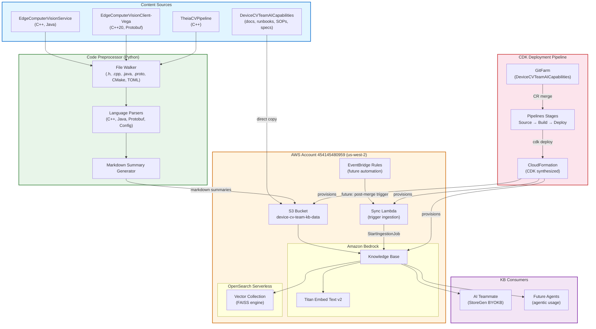
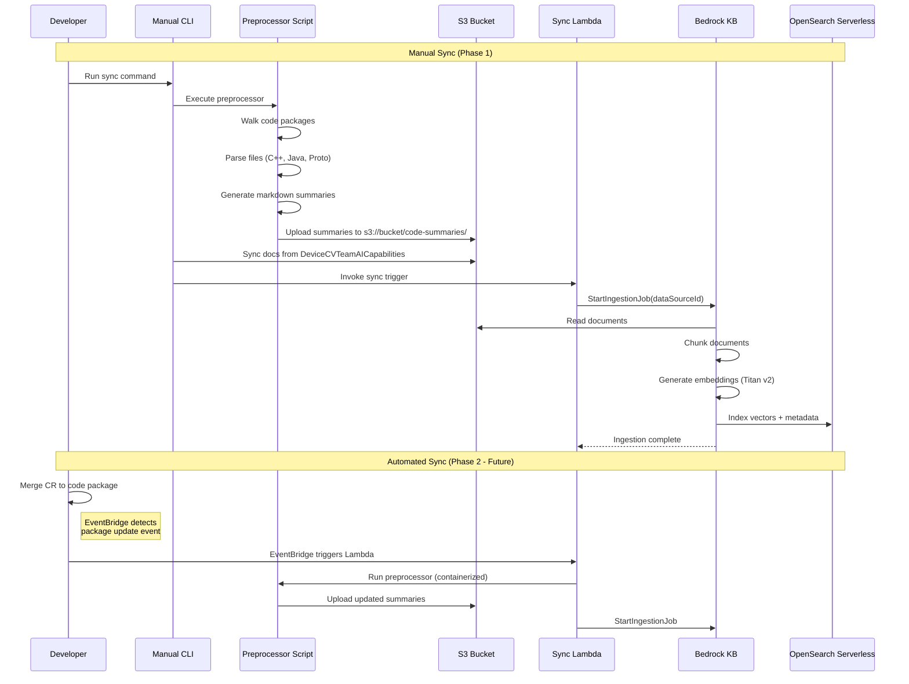
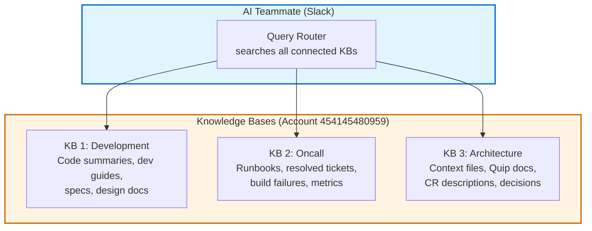

# Design Document: Bedrock Knowledge Base for Device CV Team AI Teammate

## Overview

This design covers an Amazon Bedrock Knowledge Base that serves as the retrieval-augmented generation (RAG) backend for the Device Computer Vision team's AI Teammate (StoreGen BYOKB). The KB ingests two categories of content: (1) team documentation from the `DeviceCVTeamAICapabilities` package (runbooks, specs, SOPs, context files, agent prompts, guidelines) and (2) preprocessed code summaries from three C++/Java code packages (`EdgeComputerVisionService`, `EdgeComputerVisionClient-Vega`, `TheiaCVPipeline`).

The system consists of four components: a code preprocessor script that walks source packages and generates per-file markdown summaries, a CDK stack that provisions the S3 bucket, Bedrock Knowledge Base, OpenSearch Serverless vector store, IAM roles, and sync Lambda, a sync pipeline that triggers re-ingestion on package updates, and a CDK deployment pipeline (Amazon Pipelines) that deploys infrastructure changes through a controlled release process with synthesis validation, approval gates, and automatic content sync. The infrastructure lives in AWS account `454145480959` (us-west-2) and uses `amazon.titan-embed-text-v2` for embeddings.

The Knowledge Base is designed for future agentic usage beyond the current AI Teammate integration, so IAM policies and S3 structure support multiple consumers and metadata-filtered retrieval.

## Architecture

### System Architecture



### Sync Pipeline Flow



## Components and Interfaces

### Component 1: Code Preprocessor Script

**Purpose**: Walks source code packages and generates per-file markdown summaries optimized for RAG retrieval. Handles C++ (.h, .cpp), Java (.java), Protobuf (.proto), CMake (CMakeLists.txt), TOML (manifest.toml), and config files.

**Interface**:

```typescript
interface PreprocessorConfig {
    packages: PackageConfig[];
    outputDir: string; // local output before S3 upload
    fileExtensions: string[]; // ['.h', '.cpp', '.java', '.proto', '.cmake', '.toml']
    excludePatterns: string[]; // ['build/', 'test/', '.git/']
}

interface PackageConfig {
    name: string; // e.g. 'EdgeComputerVisionService'
    rootPath: string; // absolute path to package root
    language: "cpp" | "java" | "protobuf" | "mixed";
    includeTests: boolean; // whether to include test files
}

interface FileSummary {
    filePath: string; // relative path within package
    packageName: string;
    language: string;
    purpose: string; // 1-2 sentence description
    classes: ClassSummary[];
    functions: FunctionSummary[];
    dependencies: string[]; // includes, imports
    keyPatterns: string[]; // design patterns observed
    metadata: Record<string, string>; // for S3/Bedrock metadata filtering
}

interface ClassSummary {
    name: string;
    purpose: string;
    methods: MethodSignature[];
    baseClasses: string[];
    memberVariables: string[];
}

interface FunctionSummary {
    signature: string;
    purpose: string;
    parameters: string[];
    returnType: string;
}

interface MethodSignature {
    name: string;
    signature: string;
    visibility: "public" | "private" | "protected";
    isVirtual: boolean;
    purpose: string;
}
```

**Responsibilities**:

- Recursively walk package directories respecting exclude patterns
- Parse C++ headers to extract class declarations, method signatures, includes
- Parse Java files to extract class/interface definitions, method signatures, imports
- Parse .proto files to extract message and service definitions
- Parse CMakeLists.txt to extract targets, dependencies, build configuration
- Parse TOML manifests to extract service configuration
- Generate one markdown file per source file with structured summary
- Add YAML frontmatter metadata for Bedrock metadata filtering (package, language, file_type, component)

### Component 2: CDK Stack

**Purpose**: Provisions all AWS infrastructure for the Knowledge Base: S3 data source bucket, Bedrock Knowledge Base with OpenSearch Serverless vector store, IAM roles with cross-account trust for AI Teammate, and sync trigger Lambda.

**Interface**:

```typescript
interface KBStackProps {
    account: string; // '454145480959'
    region: string; // 'us-west-2'
    kbName: string; // 'device-cv-team-kb'
    embeddingModel: string; // 'amazon.titan-embed-text-v2:0'
    aiTeammateRoleArn: string; // cross-account role for StoreGen
    chunkingStrategy: ChunkingConfig;
}

interface ChunkingConfig {
    strategy: "FIXED_SIZE" | "HIERARCHICAL" | "SEMANTIC" | "NONE";
    maxTokens: number; // 300 for fixed-size
    overlapPercentage: number; // 20%
}

// CDK Stack outputs
interface KBStackOutputs {
    knowledgeBaseId: string;
    knowledgeBaseArn: string;
    dataSourceId: string;
    s3BucketName: string;
    s3BucketArn: string;
    syncLambdaArn: string;
    ossCollectionArn: string;
}
```

**Responsibilities**:

- Create S3 bucket with versioning, encryption (SSE-S3), and lifecycle rules
- Create OpenSearch Serverless collection (vectorsearch type) with encryption and network policies
- Create Bedrock Knowledge Base with Titan Embed v2 and OpenSearch Serverless vector store
- Create S3 data source with metadata configuration for filtering
- Create IAM execution role for Bedrock KB (S3 read, OSS write, embedding model invoke)
- Create cross-account trust policy for AI Teammate role (with Isengard-safe conditions)
- Create Lambda function for sync trigger (invokes StartIngestionJob)
- Create Lambda IAM role with bedrock:StartIngestionJob permission
- Export stack outputs for CLI tooling

### Component 3: Sync Pipeline

**Purpose**: Orchestrates content refresh — runs preprocessor, uploads to S3, triggers KB re-ingestion. Phase 1 is manual CLI, Phase 2 adds EventBridge automation.

**Interface**:

```typescript
interface SyncCommand {
    action: "sync-docs" | "sync-code" | "sync-all";
    dryRun: boolean;
    verbose: boolean;
}

interface SyncResult {
    filesProcessed: number;
    filesUploaded: number;
    ingestionJobId: string;
    ingestionStatus: "STARTING" | "IN_PROGRESS" | "COMPLETE" | "FAILED";
    duration: number; // seconds
}
```

**Responsibilities**:

- `sync-docs`: Copy markdown files from DeviceCVTeamAICapabilities to S3 (preserving directory structure)
- `sync-code`: Run preprocessor on code packages, upload generated summaries to S3
- `sync-all`: Run both sync-docs and sync-code, then trigger ingestion
- Invoke sync Lambda to start Bedrock ingestion job
- Report ingestion status and errors
- Support dry-run mode for validation

### Component 4: CDK Deployment Pipeline

**Purpose**: Deploys and updates the CDK stack via an Amazon Pipelines pipeline, triggered by CR merges to the `DeviceCVTeamAICapabilities` package on GitFarm. Ensures infrastructure changes go through a controlled release process with synthesis validation, approval gates, and staged rollout.

**Pipeline Architecture**:

```mermaid
graph LR
    subgraph Source["Source Stage"]
        GF["GitFarm<br/>DeviceCVTeamAICapabilities<br/>(mainline)"]
    end

    subgraph Build["Build Stage"]
        Install["npm install<br/>(infra/)"]
        Synth["cdk synth"]
        Lint["cfn-lint<br/>template validation"]
        UnitTest["Unit tests<br/>(CDK assertions)"]
    end

    subgraph Approval["Approval Stage"]
        ManualApproval["Manual Approval<br/>(infra changes review)"]
    end

    subgraph Deploy["Deploy Stage"]
        CFNDeploy["CloudFormation Deploy<br/>DeviceCVTeamKBStack"]
        PostDeploy["Post-Deploy Validation<br/>(KB health check)"]
    end

    subgraph ContentSync["Content Sync Stage"]
        Preprocess["Run Preprocessor"]
        S3Upload["S3 Sync"]
        Ingest["Trigger Ingestion"]
    end

    GF --> Install --> Synth --> Lint --> UnitTest
    UnitTest --> ManualApproval
    ManualApproval --> CFNDeploy --> PostDeploy
    PostDeploy --> Preprocess --> S3Upload --> Ingest

    style Source fill:#e1f5ff,stroke:#0066cc
    style Build fill:#e8f5e9,stroke:#2e7d32
    style Approval fill:#fff9c4,stroke:#f9a825
    style Deploy fill:#fff4e1,stroke:#cc6600
    style ContentSync fill:#f3e5f5,stroke:#7b1fa2
```



**Interface**:

```typescript
interface PipelineConfig {
    pipelineName: string; // 'DeviceCVTeamKB-Deploy'
    sourcePackage: string; // 'DeviceCVTeamAICapabilities'
    sourceBranch: string; // 'mainline'
    account: string; // '454145480959'
    region: string; // 'us-west-2'
    approvalNotificationTopic?: string; // SNS topic for approval emails
    enableContentSync: boolean; // run preprocessor + S3 sync after deploy
}

interface PipelineStageConfig {
    source: {
        repository: string; // GitFarm package name
        branch: string;
    };
    build: {
        cdkDirectory: string; // 'infra/'
        synthCommand: string; // 'npx cdk synth'
        testCommand: string; // 'npm test'
        lintCommand: string; // 'npx cfn-lint cdk.out/*.template.json'
    };
    approval: {
        required: boolean; // true for infra changes
        timeout: string; // '72h'
        notifyEmails: string[]; // team leads
    };
    deploy: {
        stackName: string; // 'DeviceCVTeamKBStack'
        requireApproval: "never" | "any-change" | "broadening"; // 'broadening' for IAM changes
        postDeployValidation: string; // health check script path
    };
    contentSync: {
        preprocessorScript: string; // 'scripts/preprocess.py'
        syncScript: string; // 'scripts/sync-kb.sh'
        syncAction: "sync-all" | "sync-docs" | "sync-code";
    };
}
```

**Responsibilities**:

- Source stage: Watch GitFarm `DeviceCVTeamAICapabilities` mainline for CR merges
- Build stage: Install CDK dependencies, synthesize CloudFormation template, run cfn-lint validation, execute CDK assertion unit tests
- Approval stage: Manual approval gate for infrastructure changes (IAM policy changes, new resources). Sends notification to team leads via SNS
- Deploy stage: Execute CloudFormation changeset via CDK deploy. Post-deploy validation checks KB health (DescribeKnowledgeBase returns ACTIVE status)
- Content sync stage: After successful infra deploy, run the preprocessor on code packages, sync docs + code summaries to S3, trigger Bedrock ingestion job
- Rollback: CloudFormation automatic rollback on deploy failure. Content sync failures don't roll back infra (idempotent re-run)

**Pipeline Stages Detail**:

| Stage                     | Action                                 | Failure Behavior                        |
| ------------------------- | -------------------------------------- | --------------------------------------- |
| Source                    | GitFarm poll on mainline merge         | N/A — trigger only                      |
| Build — Install           | `cd infra && npm ci`                   | Pipeline fails, no deploy               |
| Build — Synth             | `npx cdk synth`                        | Pipeline fails, template error          |
| Build — Lint              | `npx cfn-lint cdk.out/*.template.json` | Pipeline fails, CFN issues              |
| Build — Test              | `npm test` (CDK assertions)            | Pipeline fails, logic error             |
| Approval                  | Manual review of CFN changeset         | Pipeline paused until approved/rejected |
| Deploy                    | `cdk deploy --require-approval never`  | CloudFormation rollback                 |
| Post-Deploy               | KB health check (ACTIVE status)        | Alarm, manual investigation             |
| Content Sync — Preprocess | `python preprocess.py`                 | Log error, continue to next stage       |
| Content Sync — S3 Upload  | `sync-kb.sh --action sync-all`         | Log error, skip ingestion               |
| Content Sync — Ingest     | Invoke sync Lambda                     | Log error, manual re-trigger            |

**Post-Deploy Validation Script**:

```typescript
async function validateKBHealth(knowledgeBaseId: string): Promise<boolean> {
    const client = new BedrockAgentClient({ region: "us-west-2" });
    const response = await client.send(
        new GetKnowledgeBaseCommand({
            knowledgeBaseId,
        }),
    );

    const status = response.knowledgeBase?.status;
    if (status !== "ACTIVE") {
        console.error(`KB status is ${status}, expected ACTIVE`);
        return false;
    }

    // Verify data source exists and is usable
    const dsList = await client.send(
        new ListDataSourcesCommand({
            knowledgeBaseId,
        }),
    );
    if (!dsList.dataSourceSummaries?.length) {
        console.error("No data sources configured");
        return false;
    }

    console.log("KB health check passed");
    return true;
}
```

## Data Models

### S3 Bucket Structure

```
device-cv-team-kb-data/
├── docs/                              # Team documentation (direct copy)
│   ├── context/                       # Context files
│   │   ├── MY_CONTEXT.md
│   │   ├── packages-cv-development-guide.md
│   │   ├── packages-davs-integration.md
│   │   ├── packages-versionset-reference.md
│   │   ├── team-runbooks-reference.md
│   │   ├── team-specs-reference.md
│   │   └── leda-integration-guide.md
│   ├── runbooks/                      # 19 oncall runbooks
│   │   ├── device-debugging.md
│   │   ├── ota-trials.md
│   │   └── ...
│   ├── specs/                         # Design docs and specs
│   │   ├── davs-integration/
│   │   ├── album-corruption-recovery/
│   │   └── ...
│   ├── agent-sops/                    # 4 SOP workflows
│   │   ├── cv-implementation.sop.md
│   │   └── ...
│   ├── prompts/                       # 4 agent system prompts
│   └── guidelines/
│       └── code-review-guidelines.md
├── code-summaries/                    # Preprocessed code (generated)
│   ├── EdgeComputerVisionService/
│   │   ├── application/
│   │   │   ├── include/
│   │   │   │   ├── CVRunner.h.md
│   │   │   │   ├── CVService.h.md
│   │   │   │   ├── davs/
│   │   │   │   │   ├── CVArtifactManager.h.md
│   │   │   │   │   └── ...
│   │   │   │   └── ...
│   │   │   └── src/
│   │   │       ├── CVRunner.cpp.md
│   │   │       └── ...
│   │   └── src/main/java/             # Java DAVS code
│   │       └── ...
│   ├── EdgeComputerVisionClient-Vega/
│   │   ├── include/
│   │   ├── src/
│   │   └── protobuf/
│   └── TheiaCVPipeline/
│       └── ...
└── .metadata/                         # Bedrock metadata config
    └── metadata.json
```

### Bedrock Metadata Schema

```typescript
// Metadata attached to each document for filtered retrieval
interface DocumentMetadata {
    source_type: "documentation" | "code-summary";
    package_name: string; // 'EdgeComputerVisionService' | 'DeviceCVTeamAICapabilities' | ...
    content_category: string; // 'runbook' | 'spec' | 'sop' | 'context' | 'prompt' | 'guideline' | 'code'
    language?: string; // 'cpp' | 'java' | 'protobuf' | 'cmake' | 'toml' | 'markdown'
    component?: string; // 'davs' | 'callbacks' | 'client' | 'metrics' | 'pipeline' | ...
    file_type?: string; // 'header' | 'implementation' | 'proto' | 'build' | 'manifest'
}
```

**Metadata Filtering Use Cases**:

- "Search only runbooks": `source_type = 'documentation' AND content_category = 'runbook'`
- "Search DAVS code": `source_type = 'code-summary' AND component = 'davs'`
- "Search EdgeComputerVisionClient-Vega": `package_name = 'EdgeComputerVisionClient-Vega'`

### Generated Code Summary Format

Each preprocessed code file produces a markdown summary:

```markdown
---
source_type: code-summary
package_name: EdgeComputerVisionService
content_category: code
language: cpp
component: davs
file_type: header
original_path: application/include/davs/CVArtifactManager.h
---

# CVArtifactManager.h

**Package**: EdgeComputerVisionService
**Path**: application/include/davs/CVArtifactManager.h
**Purpose**: High-level orchestrator for DAVS artifact downloads with multi-layer validation.

## Class: CVArtifactManager

Entry point for artifact downloads. Manages manifest validation, version compatibility,
and MD5 checksum verification.

### Public Methods

- `void requestCVModelsArtifact()` — Initiates artifact download from DAVS
- `bool validateUpdate(const ArtifactManifest& manifest)` — Multi-layer validation pipeline
- `void registerCallback(ArtifactCallback* callback)` — Register download lifecycle listener

### Dependencies

- `PipelineUpdateManager.h` — Update scheduling and state machine
- `AssetManager.h` — Multi-artifact coordination
- `DavsRequester.h` — Individual download lifecycle
- `acsdkDavsClient` — DAVS client SDK

### Key Patterns

- Callback pattern for download lifecycle events
- Multi-layer validation: manifest structure → version compatibility → MD5 checksums
- Deferred execution during device idle periods
```

## Algorithmic Pseudocode

### Code Preprocessor — Main Processing Algorithm

```typescript
// Main entry point for the preprocessor
async function preprocessPackages(
    config: PreprocessorConfig,
): Promise<FileSummary[]> {
    const allSummaries: FileSummary[] = [];

    for (const pkg of config.packages) {
        const files = walkDirectory(
            pkg.rootPath,
            config.fileExtensions,
            config.excludePatterns,
        );

        for (const filePath of files) {
            const content = readFile(filePath);
            const language = detectLanguage(filePath);
            const parser = getParser(language);

            const summary = parser.parse(content, {
                filePath: relativePath(filePath, pkg.rootPath),
                packageName: pkg.name,
                language,
            });

            const markdown = generateMarkdown(summary);
            const outputPath = path.join(
                config.outputDir,
                pkg.name,
                summary.filePath + ".md",
            );
            writeFile(outputPath, markdown);

            allSummaries.push(summary);
        }
    }

    return allSummaries;
}
```

**Preconditions:**

- All package root paths exist and are readable
- File extensions list is non-empty
- Output directory is writable

**Postconditions:**

- One markdown file generated per source file
- All markdown files contain valid YAML frontmatter
- Output directory mirrors source package structure

### C++ Header Parser Algorithm

```typescript
function parseCppHeader(content: string, context: ParseContext): FileSummary {
    const includes = extractIncludes(content); // #include directives
    const namespaces = extractNamespaces(content); // namespace blocks
    const classes = extractClasses(content); // class/struct declarations
    const freeFunctions = extractFreeFunctions(content); // non-member functions
    const enums = extractEnums(content); // enum/enum class
    const typedefs = extractTypedefs(content); // using/typedef

    const classSummaries: ClassSummary[] = classes.map((cls) => ({
        name: cls.name,
        purpose: inferPurpose(cls.name, cls.comments, cls.methods),
        methods: cls.methods.map((m) => ({
            name: m.name,
            signature: m.fullSignature,
            visibility: m.accessSpecifier,
            isVirtual: m.isVirtual || m.isPureVirtual,
            purpose: m.inlineComment || inferMethodPurpose(m.name),
        })),
        baseClasses: cls.baseClasses,
        memberVariables: cls.members
            .filter((m) => !m.isMethod)
            .map((m) => m.declaration),
    }));

    return {
        filePath: context.filePath,
        packageName: context.packageName,
        language: "cpp",
        purpose: inferFilePurpose(context.filePath, classes, freeFunctions),
        classes: classSummaries,
        functions: freeFunctions.map((fn) => ({
            signature: fn.fullSignature,
            purpose: fn.inlineComment || inferMethodPurpose(fn.name),
            parameters: fn.parameters,
            returnType: fn.returnType,
        })),
        dependencies: includes,
        keyPatterns: detectPatterns(classes, freeFunctions),
        metadata: {
            source_type: "code-summary",
            package_name: context.packageName,
            content_category: "code",
            language: "cpp",
            component: inferComponent(context.filePath),
            file_type: context.filePath.endsWith(".h")
                ? "header"
                : "implementation",
        },
    };
}
```

**Preconditions:**

- `content` is valid UTF-8 text
- `context.filePath` ends with `.h` or `.cpp`

**Postconditions:**

- All public class declarations are captured
- Method signatures preserve const, virtual, override qualifiers
- Include dependencies are fully resolved (both `""` and `<>` forms)

**Loop Invariants:**

- For class extraction: all previously extracted classes have valid name and at least one method or member

### S3 Sync Algorithm

```typescript
async function syncToS3(
    localDir: string,
    bucket: string,
    prefix: string,
    options: { dryRun: boolean; verbose: boolean },
): Promise<{ uploaded: number; skipped: number; deleted: number }> {
    // List existing S3 objects under prefix
    const existingObjects = await listS3Objects(bucket, prefix);
    const existingMap = new Map(existingObjects.map((o) => [o.Key, o.ETag]));

    // Walk local directory
    const localFiles = walkDirectory(localDir, ["**/*.md"], []);
    let uploaded = 0,
        skipped = 0;

    for (const localFile of localFiles) {
        const s3Key = path.join(prefix, relativePath(localFile, localDir));
        const localHash = computeMD5(localFile);

        // Skip if content unchanged
        if (
            existingMap.has(s3Key) &&
            existingMap.get(s3Key) === `"${localHash}"`
        ) {
            skipped++;
            existingMap.delete(s3Key);
            continue;
        }

        if (!options.dryRun) {
            await uploadToS3(
                bucket,
                s3Key,
                localFile,
                extractMetadata(localFile),
            );
        }
        uploaded++;
        existingMap.delete(s3Key);
    }

    // Remove orphaned S3 objects (files deleted locally)
    let deleted = 0;
    for (const orphanedKey of existingMap.keys()) {
        if (!options.dryRun) {
            await deleteS3Object(bucket, orphanedKey);
        }
        deleted++;
    }

    return { uploaded, skipped, deleted };
}
```

**Preconditions:**

- AWS credentials are configured with S3 read/write permissions
- `bucket` exists and is accessible
- `localDir` exists and contains markdown files

**Postconditions:**

- S3 prefix mirrors local directory structure exactly
- Unchanged files are not re-uploaded (ETag comparison)
- Files deleted locally are removed from S3
- Metadata is attached to each uploaded object

## Key Functions with Formal Specifications

### Function 1: detectLanguage()

```typescript
function detectLanguage(filePath: string): SupportedLanguage;
```

**Preconditions:**

- `filePath` is a non-empty string with a file extension

**Postconditions:**

- Returns one of: `'cpp'`, `'java'`, `'protobuf'`, `'cmake'`, `'toml'`, `'config'`
- Mapping: `.h`/`.cpp`/`.hpp`/`.cc` → `'cpp'`, `.java` → `'java'`, `.proto` → `'protobuf'`, `CMakeLists.txt`/`.cmake` → `'cmake'`, `.toml` → `'toml'`, `Config` → `'config'`
- Throws `UnsupportedFileTypeError` for unrecognized extensions

### Function 2: inferComponent()

```typescript
function inferComponent(filePath: string): string;
```

**Preconditions:**

- `filePath` is a relative path within a package

**Postconditions:**

- Returns component name derived from directory structure
- Maps known directories: `davs/` → `'davs'`, `callbacks/` → `'callbacks'`, `client/` → `'client'`, `metrics/` → `'metrics'`, `monitor/` → `'monitor'`, `provider/` → `'provider'`, `util/` → `'util'`, `protobuf/` → `'protobuf'`
- Returns `'core'` for files not in a recognized subdirectory

### Function 3: generateMarkdown()

```typescript
function generateMarkdown(summary: FileSummary): string;
```

**Preconditions:**

- `summary` has non-empty `filePath` and `packageName`
- `summary.metadata` contains all required fields

**Postconditions:**

- Returns valid markdown string with YAML frontmatter
- Frontmatter contains all metadata fields for Bedrock filtering
- Class sections include all public methods with signatures
- Dependencies section lists all includes/imports
- Output is deterministic (same input → same output)

### Function 4: startIngestionJob()

```typescript
async function startIngestionJob(
    knowledgeBaseId: string,
    dataSourceId: string,
): Promise<{ ingestionJobId: string; status: string }>;
```

**Preconditions:**

- `knowledgeBaseId` and `dataSourceId` are valid Bedrock resource IDs
- IAM role has `bedrock:StartIngestionJob` permission
- S3 data source contains at least one document

**Postconditions:**

- Returns ingestion job ID and initial status
- Ingestion job is in `STARTING` or `IN_PROGRESS` state
- Throws `IngestionError` if KB or data source not found

## Example Usage

### CLI Usage — Manual Sync

```bash
# Preprocess code packages and sync everything to S3
./sync-kb.sh --action sync-all

# Sync only documentation (no code preprocessing)
./sync-kb.sh --action sync-docs

# Sync only code summaries
./sync-kb.sh --action sync-code

# Dry run — show what would be uploaded without making changes
./sync-kb.sh --action sync-all --dry-run

# Verbose output for debugging
./sync-kb.sh --action sync-all --verbose
```

### Preprocessor Script Usage

```bash
# Run preprocessor on all configured packages
python preprocess.py \
  --packages EdgeComputerVisionService EdgeComputerVisionClient-Vega TheiaCVPipeline \
  --workspace ~/workplace/topOfTreeVega/src \
  --output ./output/code-summaries

# Run on single package
python preprocess.py \
  --packages EdgeComputerVisionService \
  --workspace ~/workplace/topOfTreeVega/src \
  --output ./output/code-summaries
```

### CDK Deployment

```bash
# Deploy the KB infrastructure stack
cd infra
npm install
npx cdk deploy DeviceCVTeamKBStack \
  --context aiTeammateRoleArn=arn:aws:iam::XXXX:role/StoreGenAITeammateRole

# View stack outputs (KB ID, S3 bucket, etc.)
npx cdk output DeviceCVTeamKBStack
```

### Querying the Knowledge Base (Future Agent Usage)

```typescript
import {
    BedrockAgentRuntimeClient,
    RetrieveCommand,
} from "@aws-sdk/client-bedrock-agent-runtime";

const client = new BedrockAgentRuntimeClient({ region: "us-west-2" });

// Basic retrieval
const response = await client.send(
    new RetrieveCommand({
        knowledgeBaseId: "KB_ID",
        retrievalQuery: {
            text: "How does CVArtifactManager validate DAVS artifacts?",
        },
        retrievalConfiguration: {
            vectorSearchConfiguration: {
                numberOfResults: 5,
                filter: {
                    andAll: [
                        {
                            equals: {
                                key: "source_type",
                                value: "code-summary",
                            },
                        },
                        { equals: { key: "component", value: "davs" } },
                    ],
                },
            },
        },
    }),
);

// Retrieve oncall runbooks only
const runbookResponse = await client.send(
    new RetrieveCommand({
        knowledgeBaseId: "KB_ID",
        retrievalQuery: { text: "VID enrollment failure on Madeleine device" },
        retrievalConfiguration: {
            vectorSearchConfiguration: {
                numberOfResults: 5,
                filter: {
                    equals: { key: "content_category", value: "runbook" },
                },
            },
        },
    }),
);
```

## Correctness Properties

1. **Completeness**: ∀ source file `f` in configured packages where `extension(f) ∈ supportedExtensions` and `path(f) ∉ excludePatterns`, ∃ corresponding markdown summary `s` in the output directory such that `s.packageName = package(f)` and `s.filePath = relativePath(f)`.

2. **Metadata Consistency**: ∀ document `d` uploaded to S3, `d.metadata.source_type ∈ {'documentation', 'code-summary'}` and `d.metadata.package_name` matches the source package name, and `d.metadata.content_category` is a valid category for the source type.

3. **Idempotency**: Running the sync pipeline twice with no source changes produces zero S3 uploads on the second run: `syncResult.uploaded = 0 ∧ syncResult.deleted = 0`.

4. **Structure Preservation**: The S3 key hierarchy under `docs/` mirrors the `DeviceCVTeamAICapabilities` directory structure, and the hierarchy under `code-summaries/{package}/` mirrors the source package directory structure.

5. **Ingestion Integrity**: After a successful ingestion job, ∀ document `d` in S3 data source, ∃ at least one vector embedding `v` in OpenSearch Serverless such that `v.metadata` contains `d.metadata` fields.

6. **Cross-Account Access**: The AI Teammate role ARN can invoke `bedrock:Retrieve` and `bedrock:RetrieveAndGenerate` on the Knowledge Base, and no other cross-account principals have access unless explicitly added.

7. **Parser Fidelity**: ∀ C++ class `C` with public methods in a header file, the generated summary contains `C.name` and all public method signatures. No private implementation details leak into summaries unless they are in the header.

## Error Handling

### Error Scenario 1: Preprocessor Parse Failure

**Condition**: A source file contains syntax that the parser cannot handle (e.g., complex C++ template metaprogramming, preprocessor macros that alter class structure).
**Response**: Log a warning with the file path and error details. Generate a minimal summary containing only the file path, detected language, and raw include/import list. Mark the summary with `parse_status: partial` in metadata.
**Recovery**: The file is still indexed with partial information. A subsequent preprocessor run after parser improvements will regenerate the full summary.

### Error Scenario 2: S3 Upload Failure

**Condition**: AWS credentials expired, bucket doesn't exist, or network error during upload.
**Response**: Retry with exponential backoff (3 attempts, 1s/2s/4s delays). If all retries fail, log the failed file and continue with remaining files. Report total failures in sync result.
**Recovery**: Re-run sync command after resolving credential/network issue. Idempotent sync ensures only failed files are re-uploaded.

### Error Scenario 3: Bedrock Ingestion Job Failure

**Condition**: Ingestion job fails due to unsupported document format, exceeding document size limits (50MB per doc), or OpenSearch Serverless capacity issues.
**Response**: Lambda logs the ingestion job ID and failure reason. CloudWatch alarm triggers on ingestion failure metric.
**Recovery**: Check ingestion job details via `GetIngestionJob` API. Fix problematic documents (e.g., split oversized files). Re-trigger ingestion.

### Error Scenario 4: Cross-Account Access Denied

**Condition**: AI Teammate role cannot invoke Retrieve API due to IAM policy misconfiguration or Isengard security policy blocking cross-account trust.
**Response**: Return clear error message indicating the specific IAM action that was denied and the principal ARN.
**Recovery**: Verify the KB resource policy includes the AI Teammate role ARN. Check Isengard security policy for cross-account trust restrictions (tracked at AI-Teammate-1925). May require security review approval.

### Error Scenario 5: OpenSearch Serverless Collection Unavailable

**Condition**: OSS collection is in CREATING or FAILED state during ingestion.
**Response**: Ingestion job will fail with a descriptive error. CDK stack creation waits for collection ACTIVE status with a timeout.
**Recovery**: Check OSS collection status in console. If FAILED, CDK stack may need to be redeployed. OSS collections typically take 5-10 minutes to become active.

## Testing Strategy

### Unit Testing Approach

- **Preprocessor parsers**: Test each language parser (C++, Java, Protobuf, CMake, TOML) with representative source files from the actual codebase. Verify extracted class names, method signatures, includes, and metadata match expected output.
- **Markdown generator**: Test that generated markdown contains valid YAML frontmatter, all required sections, and correct formatting.
- **Language detection**: Test file extension → language mapping for all supported extensions plus edge cases (no extension, unknown extension).
- **Component inference**: Test directory path → component name mapping for all known subdirectories.
- **S3 sync logic**: Test ETag comparison, orphan detection, and metadata extraction with mocked S3 client.

### Integration Testing Approach

- **End-to-end preprocessor**: Run preprocessor against a small subset of actual code packages. Verify output file count matches expected source file count (minus excluded patterns).
- **CDK stack synthesis**: Run `cdk synth` and validate CloudFormation template contains all expected resources (S3 bucket, KB, OSS collection, Lambda, IAM roles).
- **S3 upload + ingestion**: Upload test documents to S3, trigger ingestion, verify documents are retrievable via Retrieve API with correct metadata filtering.
- **Cross-account access**: Test Retrieve API call using AI Teammate role credentials (requires temporary role assumption).

### Property-Based Testing Approach

**Property Test Library**: hypothesis (Python) for preprocessor, fast-check (TypeScript) for CDK/sync

- **Preprocessor idempotency**: For any set of source files, running the preprocessor twice produces identical output.
- **Metadata completeness**: For any generated summary, all required metadata fields are present and non-empty.
- **S3 sync convergence**: For any local directory state, running sync twice results in zero changes on the second run.
- **Path mapping bijectivity**: The mapping from source file path to S3 key is injective (no two source files map to the same S3 key).

## Performance Considerations

- **Preprocessor throughput**: The three code packages contain ~500-800 source files total. Preprocessing should complete in under 60 seconds on a developer laptop. File I/O is the bottleneck; parsing is fast for the file sizes involved.
- **S3 sync efficiency**: ETag-based change detection avoids re-uploading unchanged files. Typical incremental sync (5-10 changed files) should complete in under 10 seconds.
- **Ingestion time**: Bedrock ingestion for ~100-200 markdown documents (docs + code summaries) typically takes 3-8 minutes. This is acceptable for manual sync; automated sync should be async.
- **Embedding model**: Titan Embed Text v2 supports up to 8,192 tokens per chunk. With 300-token fixed-size chunking and 20% overlap, most documents produce 3-15 chunks.
- **OpenSearch Serverless**: Vector search collection auto-scales. For the expected document volume (~200 docs, ~2000 chunks), the minimum 2 OCU configuration is sufficient.
- **Retrieval latency**: Bedrock Retrieve API typically returns results in 200-500ms for this collection size, well within AI Teammate response time requirements.

## Security Considerations

### IAM Least Privilege

- **Bedrock KB execution role**: S3 GetObject on the data source bucket only, OpenSearch Serverless data access on the specific collection only, bedrock:InvokeModel on Titan Embed v2 only.
- **Sync Lambda role**: bedrock:StartIngestionJob and bedrock:GetIngestionJob on the specific KB only. No S3 write access (Lambda only triggers ingestion, doesn't upload).
- **Cross-account trust**: Resource-based policy on the KB restricts Retrieve/RetrieveAndGenerate to the specific AI Teammate role ARN. Condition keys enforce source account and external ID where applicable.

### Isengard Security Policy (AI-Teammate-1925)

- Cross-account IAM trust policies may trigger Isengard SEV-2 auto-tickets if not configured with approved patterns.
- The CDK stack should use `aws:PrincipalOrgID` condition to restrict trust to the Amazon organization.
- If the AI Teammate account is in a different Isengard realm, a security review exception may be required.
- This is tracked as a known risk at AI-Teammate-1925 and should be resolved before production deployment.

### Data Protection

- S3 bucket uses SSE-S3 encryption at rest (default). SSE-KMS can be added if required by team security policy.
- S3 bucket policy denies non-HTTPS access (`aws:SecureTransport` condition).
- OpenSearch Serverless collection uses AWS-owned encryption key.
- No PII in the knowledge base content (code summaries and technical documentation only).
- S3 bucket has public access blocked (all four block public access settings enabled).

### Network Security

- OpenSearch Serverless uses a public endpoint with IAM authentication (no VPC endpoint needed for Bedrock-managed access).
- Lambda function runs in the default VPC-less configuration (only needs AWS API access, no VPC resources).

## Design Decisions

### Decision 1: Preprocessed Code Summaries vs Raw Source Upload

**Choice**: Preprocessed markdown summaries (Option 2)
**Rationale**: Raw C++ source files contain too much noise for RAG retrieval (preprocessor macros, template instantiations, build system artifacts). Markdown summaries with structured class/method signatures, purpose descriptions, and dependency lists produce significantly better retrieval quality. The preprocessing step also enables metadata tagging for filtered retrieval.

### Decision 2: CDK Project Location

**Recommendation**: New directory within `DeviceCVTeamAICapabilities` package at `infra/`
**Rationale**: The KB infrastructure is tightly coupled to the AI capabilities package — it serves the same agents and uses the same documentation. Keeping it in the same package simplifies the sync pipeline (docs are co-located) and avoids creating a separate Brazil package for a relatively small CDK stack. The `infra/` directory follows CDK conventions and won't interfere with the existing AIM package structure.
**Alternative considered**: Standalone `DeviceCVTeamKBInfra` Brazil package. This adds package management overhead (separate Config, version set entry, build pipeline) for minimal benefit given the small scope.

### Decision 3: Chunking Strategy

**Choice**: Fixed-size chunking with 300 tokens and 20% overlap
**Rationale**: The content is a mix of markdown documentation and code summaries. Fixed-size chunking is the most predictable for mixed content types. 300 tokens balances retrieval precision (smaller chunks = more specific matches) with context completeness (larger chunks = more surrounding context). 20% overlap ensures concepts spanning chunk boundaries are captured in at least one chunk. Hierarchical chunking was considered but adds complexity without clear benefit for this content mix.

### Decision 4: S3 Bucket Structure (docs/ vs code-summaries/)

**Choice**: Top-level split by content origin with metadata for fine-grained filtering
**Rationale**: Separating docs and code summaries at the S3 prefix level enables simple bulk operations (e.g., re-sync only code summaries after a CR merge) while Bedrock metadata filtering enables fine-grained retrieval (e.g., "only runbooks" or "only DAVS component code"). This dual approach supports both operational convenience and retrieval precision.

### Decision 5: Sync Trigger Mechanism

**Choice**: Phase 1 manual CLI, Phase 2 EventBridge automation
**Rationale**: Starting with manual CLI reduces initial complexity and allows the team to validate the KB quality before automating. The sync script is designed to be idempotent, so it's safe to run manually at any time. Phase 2 automation via EventBridge + Lambda can be added incrementally once the manual workflow is proven. CodePipeline was considered but is heavier than needed for a simple "preprocess + upload + trigger ingestion" workflow.

### Decision 6: Embedding Model Selection

**Choice**: amazon.titan-embed-text-v2 (default)
**Rationale**: Titan Embed v2 provides good performance for mixed code and documentation content. It supports up to 8,192 tokens per input, which is sufficient for the 300-token chunk size. It's the default Bedrock embedding model with no additional cost beyond standard Bedrock pricing. Cohere Embed was considered but doesn't offer significant advantages for this use case and adds vendor dependency.

### Decision 7: CDK Deployment via Pipeline

**Choice**: Amazon Pipelines with Source → Build → Approval → Deploy → Content Sync stages
**Rationale**: Infrastructure changes to the KB (IAM policies, OSS collection config, Lambda code) should go through a controlled release process rather than ad-hoc `cdk deploy` from a developer laptop. Pipelines provides: (1) audit trail for all infra changes, (2) manual approval gate for IAM/security-sensitive changes, (3) automatic rollback on CloudFormation failures, (4) content sync as a post-deploy stage so the KB is always up-to-date after infra changes. The pipeline watches the `DeviceCVTeamAICapabilities` mainline branch, so any CR merge (including doc updates, not just CDK changes) triggers a full sync cycle. This is intentional — doc updates should flow to the KB automatically.
**Alternative considered**: GitHub Actions or standalone CodePipeline. GitHub Actions doesn't integrate with GitFarm. Standalone CodePipeline adds complexity without the Brazil/Pipelines integration benefits (package versioning, version set awareness).

### Decision 8: Content Sync as Pipeline Stage vs Separate Pipeline

**Choice**: Content sync runs as the final stage of the CDK deployment pipeline
**Rationale**: Coupling content sync with infra deploy ensures the KB is always consistent — if a CDK change adds a new metadata field, the content sync immediately re-uploads documents with the new metadata. Running content sync separately would risk a window where the KB schema expects metadata that documents don't yet have. The content sync stage is designed to be resilient — failures don't roll back the infra deploy (since infra is already consistent), and the sync can be manually re-triggered. For code package CR merges (EdgeComputerVisionService, etc.), a separate lightweight pipeline or manual CLI trigger handles the sync without re-deploying infra.

### Decision 9: Multi-KB Architecture (Phase 2)

**Choice**: Multiple focused Knowledge Bases connected to AI Teammate, rather than one monolithic KB
**Rationale**: The ECommerceServices Knowledge Base Playbook recommends discrete KBs over broad ones — "GenAI agents become confused when search terms match across unrelated domains." AI Teammate supports multiple knowledge sources (each added via the console's "Add knowledge source" button) and searches all connected sources on every interaction. Focused KBs produce more precise retrieval because the embedding space isn't diluted by unrelated content. Phase 1 ships a single unified KB to validate the pipeline; Phase 2 splits into domain-specific KBs once we understand retrieval patterns from real usage.

## Phase 2: Extended Content Sources and Multi-KB Architecture

Phase 2 expands the Knowledge Base system after Phase 1 is validated. It introduces additional content sources and optionally splits into multiple focused KBs for improved retrieval precision.

### Multi-KB Architecture

AI Teammate supports connecting multiple knowledge sources simultaneously. Each KB gets its own S3 bucket, Bedrock KB, and OpenSearch Serverless collection, but they share the same CDK stack (multiple KB constructs) and deployment pipeline.



**KB Split Strategy**:

| KB           | Content                                                                                                  | Primary Users                        | Query Examples                                                                          |
| ------------ | -------------------------------------------------------------------------------------------------------- | ------------------------------------ | --------------------------------------------------------------------------------------- |
| Development  | Code summaries (C++/Java/Proto), dev guides, specs, design docs, SOPs                                    | SDEs during implementation           | "How does CVArtifactManager validate artifacts?", "What's the IPCF4 interface for CVS?" |
| Oncall       | Runbooks, resolved CVML tickets (RCAs), build failure patterns, WBR metric definitions, alarm thresholds | Oncall engineers                     | "VID enrollment failing on Madeleine", "What does DAVS_VALIDATION_FAILURE mean?"        |
| Architecture | MY_CONTEXT.md, Quip design docs, CR descriptions, decision logs, agent system prompts                    | SDEs during design, new team members | "Why did we choose callback pattern for DAVS?", "What's the CVS architecture?"          |

**Note**: Phase 1 ships as a single unified KB. The multi-KB split happens in Phase 2 only after validating retrieval quality and understanding which queries benefit from domain isolation.

### Phase 2 Content Sources

| Content Source                      | Target KB             | Priority | Sync Method                          | Format                                              | Notes                                                                                                      |
| ----------------------------------- | --------------------- | -------- | ------------------------------------ | --------------------------------------------------- | ---------------------------------------------------------------------------------------------------------- |
| Resolved CVML tickets (oncall RCAs) | Oncall                | High     | JIRA export → preprocess → S3        | Markdown with ticket metadata                       | Past bug patterns and root cause analyses. Filter to resolved tickets with RCA comments.                   |
| CR descriptions                     | Architecture          | High     | GitFarm export → preprocess → S3     | Markdown with [Problem]/[Solution]/[Test] structure | Team's structured CR format is ideal for RAG. Include reviewer comments for context.                       |
| Quip design docs                    | Architecture          | Medium   | Quip API export or manual → S3       | Markdown (converted from Quip)                      | SDD guide, AI Assisted Work Examples, Vega CV Client How-to, other docs referenced in team hubs.           |
| Slack conversation archives         | Oncall + Architecture | Medium   | Slack export → preprocess → S3       | Markdown with thread structure                      | #edge-computer-vision channel. Filter to threads with >3 replies (signal of substantive discussion).       |
| WBR metric definitions              | Oncall                | Low      | Manual markdown → S3                 | Structured markdown                                 | Alarm names, thresholds, dashboard descriptions, normal ranges. Small corpus but high-value for oncall.    |
| Build failure patterns              | Development           | Low      | Log analysis → curated markdown → S3 | Markdown with error patterns                        | Common Vodka toolchain issues, protobuf version conflicts, architecture mismatches. Curated, not raw logs. |
| Meeting decision logs               | Architecture          | Low      | Manual or vault export → S3          | Markdown                                            | Design review decisions, architecture choices, "why X instead of Y" context.                               |

### Phase 2 Preprocessing Requirements

**JIRA Ticket Preprocessor**: Extract from resolved CVML tickets:

- Ticket summary and description
- Root cause analysis (from comments tagged as RCA or resolution)
- Affected components and device types
- Resolution steps
- Metadata: ticket ID, severity, component, resolution date

**CR Description Preprocessor**: Extract from merged CRs:

- CR title and description ([Problem]/[Solution]/[Test] sections)
- Files changed (summary, not full diffs)
- Reviewer comments (actionable feedback only)
- Metadata: CR ID, JIRA link, packages modified, author

**Slack Preprocessor**: Extract from channel archives:

- Thread content (parent message + replies)
- Filter: threads with ≥3 replies, or threads containing code blocks/links
- Metadata: channel, date, participants (anonymized to aliases)
- Exclude: social messages, emoji-only replies, bot messages

### Phase 2 CDK Changes

The CDK stack extends to support multiple KBs:

```typescript
interface MultiKBStackProps extends KBStackProps {
    knowledgeBases: KBConfig[];
}

interface KBConfig {
    name: string; // 'development' | 'oncall' | 'architecture'
    description: string;
    s3Prefix: string; // prefix within shared or dedicated bucket
    dedicatedBucket: boolean; // true = own bucket, false = shared bucket with prefix
    chunkingStrategy: ChunkingConfig;
    metadataFields: string[]; // additional metadata fields for this KB
}
```

Each KB gets:

- Its own Bedrock Knowledge Base resource
- Its own OpenSearch Serverless collection (or shared collection with index-per-KB)
- Its own S3 data source (dedicated bucket or prefix within shared bucket)
- Its own IAM cross-account trust for AI Teammate
- Shared sync Lambda (parameterized by KB ID and data source ID)

### Phase 2 Timeline Estimate

| Milestone                   | Effort   | Dependency                                           |
| --------------------------- | -------- | ---------------------------------------------------- |
| JIRA ticket preprocessor    | 2-3 days | JIRA API access, filter for resolved CVML tickets    |
| CR description preprocessor | 1-2 days | GitFarm API or `cr` CLI export                       |
| Multi-KB CDK constructs     | 2-3 days | Phase 1 CDK stack working                            |
| Quip doc export pipeline    | 1 day    | Quip API access                                      |
| Slack archive preprocessor  | 2-3 days | Slack export approval, channel access                |
| KB split and validation     | 2-3 days | All preprocessors working, retrieval quality testing |

## Dependencies

- **AWS CDK v2** (TypeScript) — Infrastructure as code for all AWS resources
- **AWS SDK v3** (`@aws-sdk/client-bedrock-agent`, `@aws-sdk/client-bedrock-agent-runtime`, `@aws-sdk/client-s3`) — Sync Lambda and CLI tooling
- **Python 3.9+** — Code preprocessor script runtime
- **tree-sitter** (Python bindings) — AST parsing for C++ and Java source files (more reliable than regex for complex syntax)
- **protobuf** (Python) — Parsing .proto file definitions
- **boto3** — S3 upload from preprocessor script
- **Amazon Bedrock** — Knowledge Base service, Titan Embed Text v2 model
- **Amazon OpenSearch Serverless** — Vector store backend (Bedrock-managed)
- **Amazon S3** — Document storage / data source
- **AWS Lambda** — Sync trigger function
- **AWS EventBridge** (Phase 2) — Automated sync triggers
- **Amazon Pipelines** — CDK deployment pipeline (Source → Build → Approval → Deploy → Content Sync)
- **AWS CloudFormation** — Infrastructure deployment (CDK-synthesized templates)
- **cfn-lint** — CloudFormation template validation in build stage
- **DeviceCVTeamAICapabilities** — Source documentation package
- **EdgeComputerVisionService**, **EdgeComputerVisionClient-Vega**, **TheiaCVPipeline** — Source code packages for preprocessing
