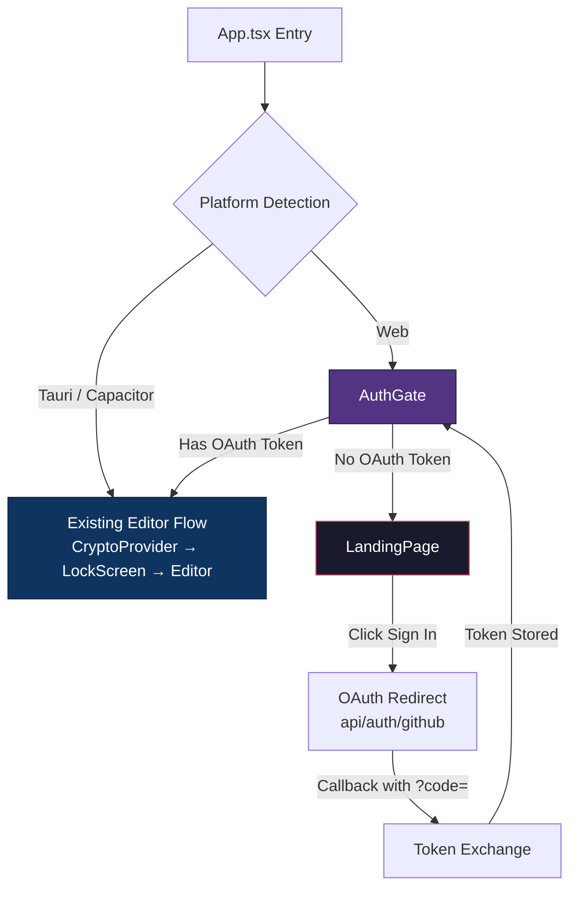
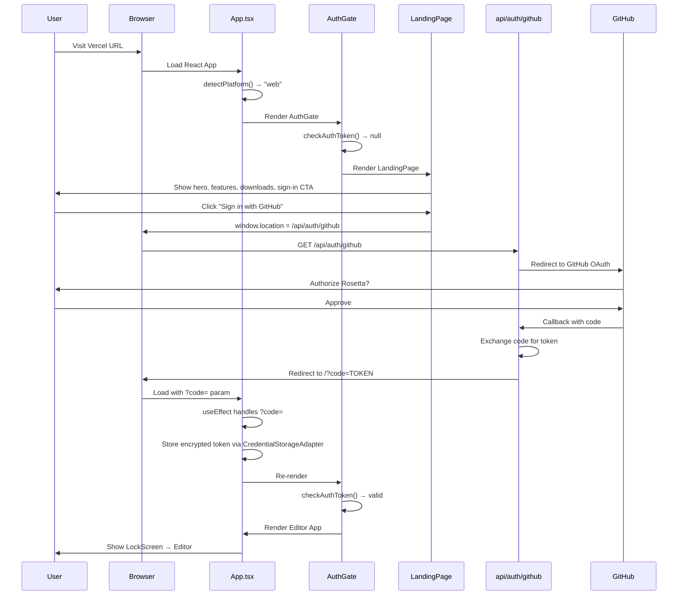
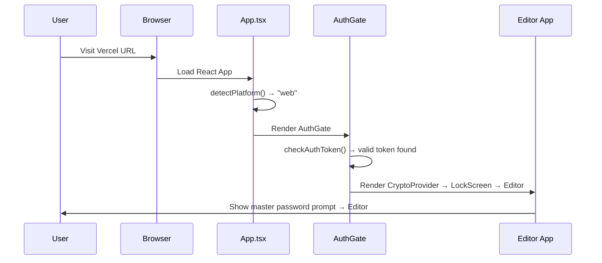
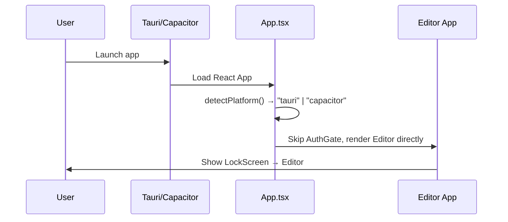

# Design Document: Rosetta Product Landing Page

## Overview

This feature transforms the Rosetta web deployment on Vercel from directly showing the editor app into a proper product experience. Unauthenticated users visiting the Vercel URL will see an Awwwards-quality product landing page with hero section, feature highlights, download CTAs (macOS .dmg, iOS TestFlight), and a "Sign in with GitHub" button. Authenticated users bypass the landing page entirely and see the existing editor app (sidebar, editor, backlinks, graph view, command palette).

The landing page is web-only. Desktop (Tauri) and mobile (Capacitor) platforms skip it entirely and go straight to the existing LockScreen → editor flow. No backend changes are needed — the existing Vercel Edge Function at `api/auth/github` handles OAuth. The implementation uses state-based routing (no react-router) to keep the architecture simple and consistent with the existing codebase pattern.

## Architecture

The routing layer sits at the top of the component tree inside `App.tsx`, above the existing `CryptoProvider`. A new `AuthGate` component checks for a stored OAuth token and renders either the `LandingPage` or the existing editor app. Platform detection (Tauri/Capacitor/Web) happens first — native platforms bypass the gate entirely.



## Sequence Diagrams

### Unauthenticated User Flow



### Authenticated User Flow (Return Visit)



### Native Platform Flow (Tauri/Capacitor)



## Components and Interfaces

### Component 1: AuthGate

**Purpose**: Top-level routing component that decides whether to show the landing page or the editor app based on authentication state and platform.

```typescript
interface AuthGateProps {
    children: React.ReactNode; // The existing editor app tree
}

interface AuthState {
    isAuthenticated: boolean;
    isLoading: boolean;
    token: string | null;
}
```

**Responsibilities**:

- Check for stored OAuth token on mount via `CredentialStorageAdapter`
- Render `LandingPage` when unauthenticated on web
- Render `children` (editor app) when authenticated or on native platforms
- Handle OAuth callback (`?code=` param) and trigger token storage
- Provide `signOut` callback to clear token and return to landing page

### Component 2: LandingPage

**Purpose**: Awwwards-quality product landing page shown to unauthenticated web users. Lazy-loaded to keep it out of the editor bundle.

```typescript
interface LandingPageProps {
    onSignIn: () => void; // Triggers OAuth redirect
}

interface FeatureCard {
    icon: string;
    title: string;
    description: string;
}

interface DownloadLink {
    platform: "macos" | "ios";
    label: string;
    url: string;
    icon: string;
}
```

**Responsibilities**:

- Render hero section with animated gradient background
- Render feature grid (E2EE, graph view, bidirectional links, BYOC sync, etc.)
- Render download section with macOS (.dmg) and iOS (TestFlight) CTAs
- Render "Sign in with GitHub" button
- Smooth scroll navigation between sections
- Fully responsive (mobile-first)

### Component 3: Platform Detection Utility

**Purpose**: Detect runtime platform to gate landing page to web-only.

```typescript
type Platform = "web" | "tauri" | "capacitor";

interface PlatformInfo {
    platform: Platform;
    isNative: boolean;
    isWeb: boolean;
}
```

**Responsibilities**:

- Check for `window.__TAURI__` or `@tauri-apps/api` presence
- Check for `Capacitor.isNativePlatform()` presence
- Return platform info synchronously on app boot
- Used by `App.tsx` to skip `AuthGate` on native platforms

### Component 4: LandingHero

**Purpose**: Hero section with animated background, tagline, and primary CTA.

```typescript
interface LandingHeroProps {
    onSignIn: () => void;
    onScrollToFeatures: () => void;
}
```

**Responsibilities**:

- Animated gradient/mesh background using CSS animations or framer-motion
- App name, tagline, and description
- "Sign in with GitHub" primary CTA button
- "Learn more" scroll-down indicator
- Glassmorphism card effect for the hero content container

### Component 5: FeatureGrid

**Purpose**: Grid of feature cards highlighting Rosetta's capabilities.

```typescript
interface FeatureGridProps {
    features: FeatureCard[];
}
```

**Responsibilities**:

- Responsive grid layout (1 col mobile, 2 col tablet, 3 col desktop)
- Glassmorphism card styling with hover effects
- Scroll-triggered fade-in animations via framer-motion
- Icons for each feature (E2EE, graph view, wikilinks, Git sync, command palette, cross-platform)

### Component 6: DownloadSection

**Purpose**: Download CTAs for native apps.

```typescript
interface DownloadSectionProps {
    downloads: DownloadLink[];
}
```

**Responsibilities**:

- macOS .dmg download button (links to GitHub Releases)
- iOS TestFlight button (links to TestFlight invite)
- Platform-appropriate icons (Apple logo, macOS icon)
- Subtle animation on hover

### Component 7: LandingFooter

**Purpose**: Minimal footer with links and branding.

```typescript
interface LandingFooterProps {
    githubUrl: string;
}
```

**Responsibilities**:

- GitHub repo link
- "Built with ❤️" branding
- Privacy/terms links (if applicable)

## Data Models

### AuthToken (stored via CredentialStorageAdapter)

```typescript
interface StoredAuthToken {
    accessToken: string; // GitHub OAuth access token
    tokenType: string; // "bearer"
    scope: string; // OAuth scopes granted
    createdAt: number; // Unix timestamp when stored
}
```

**Validation Rules**:

- `accessToken` must be non-empty string
- `createdAt` must be valid Unix timestamp
- Token is stored encrypted via existing `CredentialStorageAdapter` (WebCrypto on web)

### LandingPageContent (static config)

```typescript
interface LandingPageContent {
    hero: {
        title: string;
        subtitle: string;
        description: string;
    };
    features: FeatureCard[];
    downloads: DownloadLink[];
    footer: {
        githubUrl: string;
        year: number;
    };
}
```

**Validation Rules**:

- All string fields non-empty
- `downloads` array must have at least one entry
- `features` array must have at least 4 entries for visual balance

## Algorithmic Pseudocode

### Main Routing Algorithm

```typescript
ALGORITHM appRouting(appState)
INPUT: appState containing platform info and auth state
OUTPUT: rendered component tree

BEGIN
  // Step 1: Detect platform
  platform ← detectPlatform()

  // Step 2: Native platforms bypass landing page entirely
  IF platform.isNative THEN
    RETURN renderEditorApp()  // CryptoProvider → LockScreen → Editor
  END IF

  // Step 3: Web platform — check auth state
  authState ← checkAuthToken()

  // Step 4: Handle OAuth callback if present
  IF url.searchParams.has("code") THEN
    token ← exchangeCodeForToken(url.searchParams.get("code"))
    storeToken(token)
    clearUrlParams()
    authState ← { isAuthenticated: true, token }
  END IF

  // Step 5: Route based on auth
  IF authState.isAuthenticated THEN
    RETURN renderEditorApp()
  ELSE
    RETURN renderLandingPage()
  END IF
END
```

**Preconditions:**

- React app has mounted
- `CredentialStorageAdapter` is available
- Platform detection APIs are accessible (window.**TAURI**, Capacitor)

**Postconditions:**

- Exactly one view is rendered: LandingPage or EditorApp
- Native platforms never see the landing page
- OAuth callback is handled and URL is cleaned

### Auth Token Check Algorithm

```typescript
ALGORITHM checkAuthToken()
INPUT: none (reads from CredentialStorageAdapter)
OUTPUT: AuthState { isAuthenticated, isLoading, token }

BEGIN
  SET isLoading ← true

  TRY
    token ← CredentialStorageAdapter.getToken("github_oauth")

    IF token IS NULL OR token.accessToken IS EMPTY THEN
      RETURN { isAuthenticated: false, isLoading: false, token: null }
    END IF

    // Token exists — consider authenticated
    // (Token validation happens server-side on API calls)
    RETURN { isAuthenticated: true, isLoading: false, token }

  CATCH error
    console.error("Auth check failed:", error)
    RETURN { isAuthenticated: false, isLoading: false, token: null }
  END TRY
END
```

**Preconditions:**

- `CredentialStorageAdapter` is initialized
- WebCrypto API is available (for decryption)

**Postconditions:**

- Returns valid `AuthState` object
- Never throws — errors result in unauthenticated state
- `isLoading` is false when returned

### Platform Detection Algorithm

```typescript
ALGORITHM detectPlatform()
INPUT: none (reads from window/global scope)
OUTPUT: PlatformInfo { platform, isNative, isWeb }

BEGIN
  // Check Tauri first (desktop)
  IF window.__TAURI__ IS DEFINED THEN
    RETURN { platform: "tauri", isNative: true, isWeb: false }
  END IF

  // Check Capacitor (mobile)
  IF window.Capacitor IS DEFINED AND Capacitor.isNativePlatform() THEN
    RETURN { platform: "capacitor", isNative: true, isWeb: false }
  END IF

  // Default: web
  RETURN { platform: "web", isNative: false, isWeb: true }
END
```

**Preconditions:**

- Called after DOM is available (not during SSR)

**Postconditions:**

- Returns exactly one platform type
- `isNative` and `isWeb` are mutually exclusive
- Tauri detection takes priority over Capacitor

## Key Functions with Formal Specifications

### Function 1: detectPlatform()

```typescript
function detectPlatform(): PlatformInfo;
```

**Preconditions:**

- `window` object is available (browser environment)

**Postconditions:**

- Returns `PlatformInfo` with exactly one platform identified
- Pure function with no side effects
- Deterministic for a given runtime environment

**Loop Invariants:** N/A

### Function 2: useAuthState()

```typescript
function useAuthState(): AuthState & {
    signIn: () => void;
    signOut: () => void;
};
```

**Preconditions:**

- Called within a React component
- `CredentialStorageAdapter` is available in scope

**Postconditions:**

- Returns current auth state with `isLoading` initially `true`
- `signIn()` redirects to `/api/auth/github`
- `signOut()` clears stored token and sets `isAuthenticated` to `false`
- Handles `?code=` URL param on mount if present
- Cleans URL after processing OAuth callback

**Loop Invariants:** N/A

### Function 3: handleOAuthCallback()

```typescript
async function handleOAuthCallback(code: string): Promise<StoredAuthToken>;
```

**Preconditions:**

- `code` is a non-empty string from GitHub OAuth redirect
- Network is available to reach `/api/auth/github`

**Postconditions:**

- Returns `StoredAuthToken` on success
- Token is stored encrypted via `CredentialStorageAdapter`
- URL `?code=` param is removed from browser history
- Throws on network failure or invalid code

**Loop Invariants:** N/A

## Example Usage

### App.tsx Integration

```typescript
// src/App.tsx — modified entry point
import { lazy, Suspense } from 'react';
import { detectPlatform } from './utils/platform';
import { AuthGate } from './components/AuthGate';
import { CryptoProvider } from './contexts/CryptoContext';

const LandingPage = lazy(() => import('./components/landing/LandingPage'));

function App() {
  const platform = detectPlatform();

  // Native platforms: skip landing page entirely
  if (platform.isNative) {
    return (
      <CryptoProvider>
        <EditorApp />
      </CryptoProvider>
    );
  }

  // Web: gate on auth
  return (
    <AuthGate
      landingPage={
        <Suspense fallback={<div className="loading-screen" />}>
          <LandingPage onSignIn={() => window.location.href = '/api/auth/github'} />
        </Suspense>
      }
    >
      <CryptoProvider>
        <EditorApp />
      </CryptoProvider>
    </AuthGate>
  );
}
```

### AuthGate Component

```typescript
// src/components/AuthGate.tsx
import { useAuthState } from '../hooks/useAuthState';

interface AuthGateProps {
  children: React.ReactNode;
  landingPage: React.ReactNode;
}

export function AuthGate({ children, landingPage }: AuthGateProps) {
  const { isAuthenticated, isLoading } = useAuthState();

  if (isLoading) {
    return <div className="loading-screen" />;
  }

  return isAuthenticated ? <>{children}</> : <>{landingPage}</>;
}
```

### useAuthState Hook

```typescript
// src/hooks/useAuthState.ts
import { useState, useEffect } from "react";
import { CredentialStorageAdapter } from "../services/CryptoService";

export function useAuthState() {
    const [state, setState] = useState<AuthState>({
        isAuthenticated: false,
        isLoading: true,
        token: null,
    });

    useEffect(() => {
        // Check for OAuth callback
        const params = new URLSearchParams(window.location.search);
        const code = params.get("code");

        if (code) {
            handleOAuthCallback(code).then((token) => {
                setState({ isAuthenticated: true, isLoading: false, token });
                window.history.replaceState({}, "", window.location.pathname);
            });
            return;
        }

        // Check for existing token
        CredentialStorageAdapter.getToken("github_oauth").then((token) => {
            setState({
                isAuthenticated: !!token,
                isLoading: false,
                token,
            });
        });
    }, []);

    const signIn = () => {
        window.location.href = "/api/auth/github";
    };
    const signOut = async () => {
        await CredentialStorageAdapter.removeToken("github_oauth");
        setState({ isAuthenticated: false, isLoading: false, token: null });
    };

    return { ...state, signIn, signOut };
}
```

### Platform Detection

```typescript
// src/utils/platform.ts
export type Platform = "web" | "tauri" | "capacitor";

export interface PlatformInfo {
    platform: Platform;
    isNative: boolean;
    isWeb: boolean;
}

export function detectPlatform(): PlatformInfo {
    if (typeof window !== "undefined" && (window as any).__TAURI__) {
        return { platform: "tauri", isNative: true, isWeb: false };
    }

    if (
        typeof window !== "undefined" &&
        (window as any).Capacitor?.isNativePlatform?.()
    ) {
        return { platform: "capacitor", isNative: true, isWeb: false };
    }

    return { platform: "web", isNative: false, isWeb: true };
}
```

## Correctness Properties

_A property is a characteristic or behavior that should hold true across all valid executions of a system — essentially, a formal statement about what the system should do. Properties serve as the bridge between human-readable specifications and machine-verifiable correctness guarantees._

### Property 1: Platform detection correctness

_For any_ combination of `window.__TAURI__` and `Capacitor.isNativePlatform()` presence/absence, `detectPlatform()` should return the correct platform type, and the returned `isNative` and `isWeb` fields should always be boolean opposites. When both Tauri and Capacitor are present, the result should be "tauri".

**Validates: Requirements 1.1, 1.2, 1.3, 1.4**

### Property 2: Auth state reflects token validity

_For any_ StoredAuthToken (or null) returned by the CredentialStorageAdapter, `isAuthenticated` should be `true` if and only if the token is non-null and has a non-empty `accessToken` field.

**Validates: Requirements 2.2, 2.3**

### Property 3: Native platform exclusivity

_For any_ session where `detectPlatform()` returns `isNative: true`, the LandingPage component should never be rendered and the AuthGate should be bypassed entirely.

**Validates: Requirements 3.1**

### Property 4: Web routing completeness

_For any_ web session after the auth loading state completes, exactly one of LandingPage or EditorApp should be rendered — never both simultaneously and never neither.

**Validates: Requirements 3.4**

### Property 5: Token persistence round-trip

_For any_ valid StoredAuthToken, storing it via the CredentialStorageAdapter and then retrieving it should return a token where `isAuthenticated` evaluates to `true` on subsequent `checkAuthToken()` calls.

**Validates: Requirements 4.3**

### Property 6: OAuth callback URL cleanup

_For any_ OAuth callback where the URL contains a `?code=` parameter, after the AuthGate processes the callback, `window.location.search` should not contain the `code` parameter.

**Validates: Requirements 4.5**

### Property 7: Sign-out idempotence

_For any_ prior authentication state, calling `signOut()` one or more times should always result in `isAuthenticated === false` and `checkAuthToken()` returning unauthenticated state. Calling `signOut()` twice should produce the same result as calling it once.

**Validates: Requirements 5.1, 5.2, 5.3**

### Property 8: Landing page content minimums

_For any_ valid LandingPageContent configuration, the rendered LandingPage should contain at least 4 feature cards in the FeatureGrid and at least 1 download CTA in the DownloadSection.

**Validates: Requirements 6.2, 6.3**

### Property 9: Token validation

_For any_ StoredAuthToken candidate, the AuthGate should accept it for storage if and only if `accessToken` is a non-empty string and `createdAt` is a valid Unix timestamp. Tokens failing validation should be rejected.

**Validates: Requirements 10.1, 10.2**

### Property 10: E2EE non-interference

_For any_ sequence of AuthGate operations (sign-in, sign-out, token check), the CryptoProvider state (master password, vault encryption key, lock state) should remain completely independent and unmodified.

**Validates: Requirements 11.2**

## Error Handling

### Error Scenario 1: OAuth Code Exchange Failure

**Condition**: Network error or invalid code during `handleOAuthCallback()`
**Response**: Catch error, log to console, remain on landing page with unauthenticated state
**Recovery**: User can retry by clicking "Sign in with GitHub" again. No stale state is stored.

### Error Scenario 2: Stored Token Corrupted or Unreadable

**Condition**: `CredentialStorageAdapter.getToken()` throws (e.g., WebCrypto decryption failure, IndexedDB corruption)
**Response**: Catch error, treat as unauthenticated, show landing page
**Recovery**: User signs in again, which overwrites the corrupted token. Existing E2EE vault key is unaffected (separate storage path).

### Error Scenario 3: Platform Detection Failure

**Condition**: `window.__TAURI__` or `Capacitor` APIs are undefined in an unexpected environment
**Response**: Default to `"web"` platform — show AuthGate with landing page
**Recovery**: No recovery needed. Web is the safe default. Native users would never hit this path since their runtime always injects the platform globals.

### Error Scenario 4: Landing Page Lazy Load Failure

**Condition**: Network error loading the `LandingPage` chunk (code splitting)
**Response**: `Suspense` fallback remains visible. React error boundary catches chunk load failure.
**Recovery**: User refreshes the page. Consider adding a retry button in the error boundary.

### Error Scenario 5: OAuth Redirect Loop

**Condition**: User clicks sign in, authorizes on GitHub, but token storage fails silently — causing repeated redirects
**Response**: Detect repeated `?code=` processing (e.g., sessionStorage flag) and break the loop after 1 attempt
**Recovery**: Show error message on landing page: "Sign in failed. Please try again."

## Testing Strategy

### Unit Testing Approach

- `detectPlatform()`: Mock `window.__TAURI__` and `Capacitor` globals, verify correct platform detection for all 3 cases
- `useAuthState()`: Mock `CredentialStorageAdapter`, test loading → authenticated and loading → unauthenticated transitions
- `handleOAuthCallback()`: Mock fetch to `/api/auth/github`, verify token storage on success and error handling on failure
- `AuthGate`: Render with mocked auth state, verify correct child rendering (landing vs editor)
- OAuth callback cleanup: Verify `?code=` is removed from URL after processing

### Property-Based Testing Approach

**Property Test Library**: fast-check

- **Platform detection is deterministic**: For any combination of `window.__TAURI__` and `Capacitor` presence, `detectPlatform()` always returns the same result
- **Auth state is binary**: After loading, `isAuthenticated` is always `true` or `false`, never undefined
- **Sign-out always results in unauthenticated**: For any prior auth state, calling `signOut()` always results in `isAuthenticated === false`

### Integration Testing Approach

- Full OAuth flow: Mock GitHub OAuth redirect, verify token exchange and storage, verify editor renders after auth
- Landing page → sign in → editor transition: Verify smooth state transition without flicker
- Native platform bypass: Verify Tauri/Capacitor environments never render landing page components
- Lazy loading: Verify landing page chunk is separate from editor chunk in build output

## Landing Page Visual Design

### Design Language

The landing page follows an Awwwards-inspired dark theme aesthetic:

- **Background**: Deep dark gradient (`#0a0a0f` → `#1a1a2e`) with subtle animated mesh/grain
- **Cards**: Glassmorphism effect — `backdrop-filter: blur(16px)`, semi-transparent backgrounds (`rgba(255,255,255,0.05)`), subtle borders (`rgba(255,255,255,0.1)`)
- **Typography**: System font stack, large hero text (4-6rem), generous line height
- **Colors**: Primary accent `#e94560` (coral red), secondary `#533483` (purple), text `#f5f5f5` / `#a0a0b0`
- **Animations**: Smooth scroll, fade-in on scroll (framer-motion `whileInView`), subtle hover transforms on cards
- **Responsive**: Mobile-first, breakpoints at 640px, 768px, 1024px

### CSS Architecture

Following the existing CSS-per-component pattern (no Tailwind):

```
src/components/landing/
├── LandingPage.tsx
├── LandingPage.css          # Layout, sections, scroll behavior
├── LandingHero.tsx
├── LandingHero.css           # Hero gradient, glassmorphism card, CTA button
├── FeatureGrid.tsx
├── FeatureGrid.css           # Grid layout, card styles, hover effects
├── DownloadSection.tsx
├── DownloadSection.css       # Download buttons, platform icons
├── LandingFooter.tsx
└── LandingFooter.css         # Footer layout, links
```

### Key CSS Patterns

```css
/* Glassmorphism card */
.glass-card {
    background: rgba(255, 255, 255, 0.05);
    backdrop-filter: blur(16px);
    -webkit-backdrop-filter: blur(16px);
    border: 1px solid rgba(255, 255, 255, 0.1);
    border-radius: 16px;
    transition:
        transform 0.3s ease,
        border-color 0.3s ease;
}

.glass-card:hover {
    transform: translateY(-4px);
    border-color: rgba(233, 69, 96, 0.3);
}

/* Animated gradient background */
.hero-gradient {
    background: linear-gradient(135deg, #0a0a0f 0%, #1a1a2e 50%, #16213e 100%);
    position: relative;
    overflow: hidden;
}

.hero-gradient::before {
    content: "";
    position: absolute;
    inset: 0;
    background:
        radial-gradient(
            circle at 30% 50%,
            rgba(233, 69, 96, 0.15),
            transparent 50%
        ),
        radial-gradient(
            circle at 70% 50%,
            rgba(83, 52, 131, 0.15),
            transparent 50%
        );
    animation: gradientShift 8s ease-in-out infinite alternate;
}
```

## Performance Considerations

- **Code Splitting**: `LandingPage` is lazy-loaded via `React.lazy()` — its CSS and JS are in a separate chunk, never loaded for authenticated users or native platforms
- **No framer-motion on native**: Since landing page is web-only, framer-motion is only in the landing chunk — zero impact on native bundle size
- **Minimal landing page weight**: Target < 50KB gzipped for the landing page chunk (HTML + CSS + minimal JS for animations)
- **No API calls on landing**: The landing page is fully static — no data fetching, no loading states
- **Auth check is fast**: Token check via `CredentialStorageAdapter` reads from IndexedDB/localStorage — sub-10ms on modern browsers
- **Image optimization**: Any hero images or screenshots should use WebP format with lazy loading

## Security Considerations

- **OAuth token storage**: Tokens are stored encrypted via the existing `CredentialStorageAdapter` using WebCrypto AES-GCM — same security model as the existing PAT storage
- **No token in URL**: The `?code=` parameter is an authorization code (not a token) — it's exchanged server-side by the Edge Function. The actual token never appears in the URL
- **CSRF protection**: GitHub OAuth state parameter should be used (verify existing Edge Function implements this)
- **Token scope**: OAuth token should request minimal scopes (repo access for sync only)
- **Sign-out completeness**: `signOut()` must clear the token from `CredentialStorageAdapter` — not just from React state
- **No editor code leak**: Lazy loading ensures unauthenticated users cannot inspect editor source code in the initial bundle (though determined users could still find the chunk URL)
- **E2EE unaffected**: The OAuth token is for GitHub API access only. The E2EE master password and vault encryption key derivation (PBKDF2 → AES-GCM) remain completely separate and unchanged

## Dependencies

### New Dependencies

| Package         | Purpose                                                              | Bundle Impact                      |
| --------------- | -------------------------------------------------------------------- | ---------------------------------- |
| `framer-motion` | Scroll animations, fade-in effects, page transitions on landing page | ~30KB gzipped (landing chunk only) |

### Existing Dependencies (no changes)

| Package       | Role in This Feature                                   |
| ------------- | ------------------------------------------------------ |
| React 19      | Component rendering, lazy loading, Suspense            |
| TypeScript    | Type safety for all new components                     |
| Vite 8        | Code splitting for landing page chunk                  |
| WebCrypto API | Token encryption via existing CredentialStorageAdapter |

### No New Dependencies Needed For

- **Routing**: State-based routing via `AuthGate` (no react-router)
- **Styling**: CSS-per-component pattern (no Tailwind)
- **Icons**: Inline SVG or CSS-only icons for feature cards and download buttons
- **Animations**: CSS animations for gradient background; framer-motion only for scroll-triggered effects
