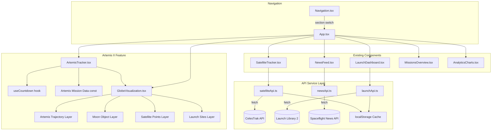
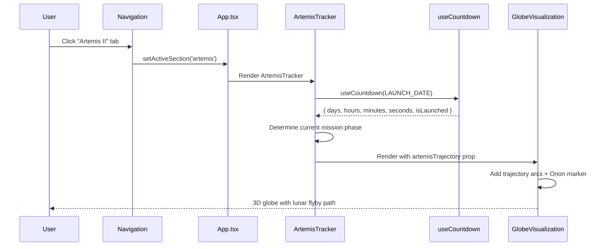
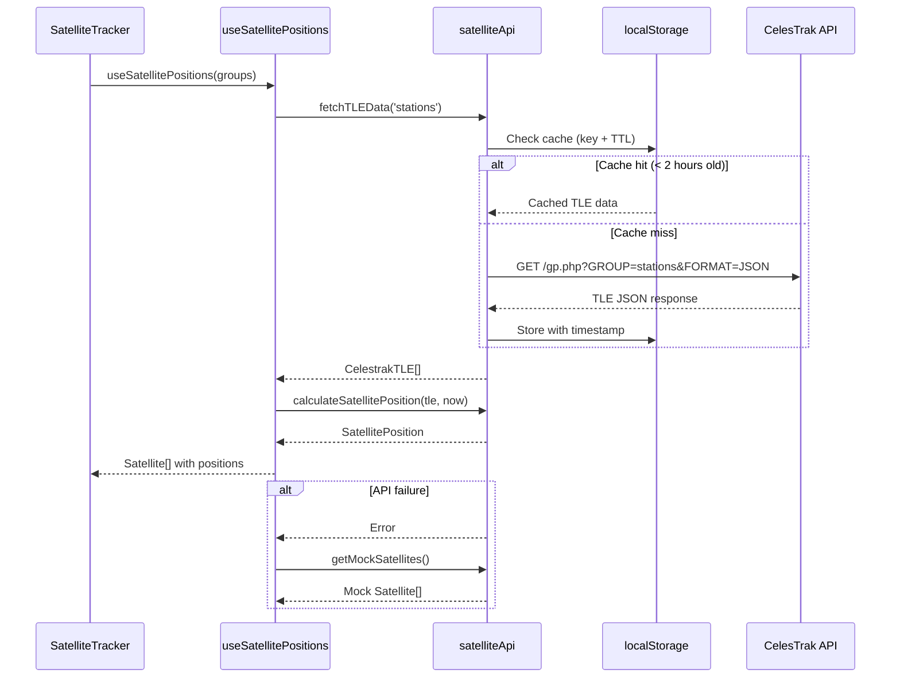
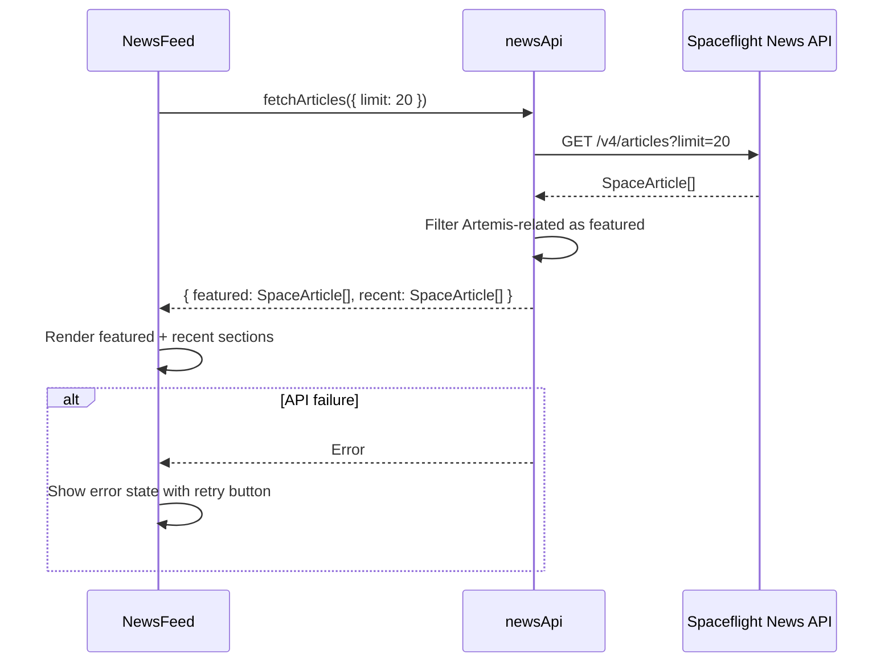

# Design Document: Satellitemap Artemis Tracker

## Overview

The Artemis Tracker feature transforms the existing spacex-mission-control platform from a mock-data demo into a production-grade space tracking application, centered around the Artemis II lunar mission launching April 1, 2026. The feature encompasses three major workstreams: (1) a dedicated Artemis II mission tracker with countdown, crew profiles, mission timeline, phase indicator, and trajectory visualization on the 3D globe; (2) wiring real API data from CelesTrak, Launch Library 2, and Spaceflight News API into existing components to replace all mock data; and (3) updating navigation to prominently feature the Artemis II mission.

The system leverages the existing Globe.gl + satellite.js + React 18 stack, adding new components and hooks while refactoring existing service layers to support real data with graceful mock fallbacks. All mission-specific data (timeline, crew, trajectory waypoints) is hardcoded since Artemis II is a fully known mission profile. API integrations use localStorage caching with TTL to respect rate limits and provide offline resilience.

## Architecture

The application follows a component-driven architecture with lazy-loaded sections, custom hooks for data fetching and real-time calculations, and a service layer abstracting API calls with mock fallbacks.



## Sequence Diagrams

### Artemis Tracker Initialization Flow



### Real Data Wiring Flow (Satellite Example)



### News Feed Real Data Flow



## Components and Interfaces

### Component 1: ArtemisTracker

**Purpose**: Dedicated Artemis II mission page with countdown, crew cards, mission timeline, phase indicator, and links to NASA live stream.

**Interface**:

```typescript
interface ArtemisTrackerProps {
    onNavigateToGlobe?: () => void;
}
```

**Responsibilities**:

- Display live countdown to launch using `useCountdown` hook
- Render crew cards for all 4 astronauts
- Show mission timeline with 12 key milestones and current phase highlighting
- Display mission stats (distance, duration, reentry speed)
- Provide link to NASA YouTube live stream
- Communicate current mission phase to globe for trajectory visualization

### Component 2: GlobeVisualization (Modified)

**Purpose**: Extended to support Artemis II trajectory overlay alongside existing satellite and launch site layers.

**Interface**:

```typescript
interface GlobeVisualizationProps {
    showArtemisTrajectory?: boolean;
    currentMissionPhase?: ArtemisMissionPhase;
    satellites?: Satellite[];
    launchSites?: LaunchSite[];
}
```

**Responsibilities**:

- Render 3D Earth with existing satellite dots and launch site markers
- Render the Moon as a secondary sphere at its approximate real-time position relative to Earth (using simplified lunar ephemeris or pre-computed position for the mission window)
- Overlay Artemis II trajectory as arc paths (Earth orbits + TLI + lunar flyby around Moon + return)
- Animate Orion spacecraft marker along trajectory based on current phase
- Toggle trajectory visibility
- Color-code trajectory segments by phase
- Scale Moon size and distance for visual clarity (true scale makes Moon invisible; use artistic scaling ~10-20x closer, ~3-5x larger)

### Component 3: Navigation (Modified)

**Purpose**: Updated to include Artemis II as a prominent navigation tab with visual indicators.

**Interface**:

```typescript
type NavigationSection =
    | "globe"
    | "artemis"
    | "launches"
    | "satellites"
    | "missions"
    | "analytics"
    | "news";

interface NavigationProps {
    activeSection: NavigationSection;
    onSectionChange: (section: NavigationSection) => void;
}
```

**Responsibilities**:

- Render Artemis II tab with Moon icon (from Lucide)
- Show pulsing "LIVE" badge during mission window (launch day ± 10 days)
- Position Artemis II tab second in order (after Globe)

### Component 4: SatelliteTracker (Modified)

**Purpose**: Refactored to consume real CelesTrak TLE data instead of mock data.

**Responsibilities**:

- Fetch real TLE data via `satelliteApi.fetchTLEData()` for configured groups
- Display loading states during API calls
- Fall back to mock data on API failure
- Show satellite count and last-updated timestamp

### Component 5: LaunchDashboard (Modified)

**Purpose**: Refactored to consume real Launch Library 2 data.

**Responsibilities**:

- Fetch real launch data via `launchApi.getUpcomingLaunches()` and `getPastLaunches()`
- Pin Artemis II as featured launch at top
- Display loading/error states
- Fall back to mock data when rate-limited

### Component 6: NewsFeed (Modified)

**Purpose**: Connected to Spaceflight News API v4 for real articles.

**Responsibilities**:

- Fetch articles from Spaceflight News API
- Filter and feature Artemis-related articles
- Display loading skeleton states
- Show error state with retry capability

## Data Models

### ArtemisPhase

```typescript
interface ArtemisPhase {
    id: string;
    name: string;
    description: string;
    timestamp: Date | null;
    missionElapsedTime: string;
    status: "completed" | "active" | "upcoming";
}
```

**Validation Rules**:

- `id` must be unique across all phases
- `missionElapsedTime` format: `T+HH:MM` or `Day N`
- `status` must reflect temporal ordering (no 'upcoming' before an 'active')

### ArtemisCrewMember

```typescript
interface ArtemisCrewMember {
    name: string;
    role: "Commander" | "Pilot" | "Mission Specialist";
    agency: "NASA" | "CSA";
    bio: string;
    imageUrl: string;
}
```

### ArtemisMissionPhase

```typescript
type ArtemisMissionPhase =
    | "pre-launch"
    | "ascent"
    | "earth-orbit"
    | "translunar"
    | "lunar-flyby"
    | "return"
    | "reentry"
    | "splashdown";
```

### TrajectoryWaypoint

```typescript
interface TrajectoryWaypoint {
    lat: number;
    lng: number;
    alt: number;
    phase: ArtemisMissionPhase;
}
```

**Validation Rules**:

- `lat` must be in range [-90, 90]
- `lng` must be in range [-180, 180]
- `alt` must be non-negative (in km)

### MoonPosition

```typescript
interface MoonPosition {
    lat: number; // Sub-lunar point latitude on Earth's surface
    lng: number; // Sub-lunar point longitude on Earth's surface
    distance: number; // Distance from Earth center in km (~384,400 km avg)
}
```

**Validation Rules**:

- `lat` must be in range [-28.5, 28.5] (Moon's orbital inclination ~5.14° + Earth's axial tilt)
- `lng` must be in range [-180, 180]
- `distance` must be in range [356,000, 407,000] (perigee to apogee in km)

### CacheEntry (for localStorage caching)

```typescript
interface CacheEntry<T> {
    data: T;
    timestamp: number;
    ttl: number;
}
```

**Validation Rules**:

- `ttl` must be positive (in milliseconds)
- `timestamp` must be a valid Unix epoch ms value

### Extended NavigationSection

```typescript
type NavigationSection =
    | "globe"
    | "artemis"
    | "launches"
    | "satellites"
    | "missions"
    | "analytics"
    | "news";
```

## Key Functions with Formal Specifications

### Function 1: getMissionPhase()

```typescript
function getMissionPhase(launchDate: Date, now: Date): ArtemisMissionPhase;
```

**Preconditions:**

- `launchDate` is a valid Date object representing April 1, 2026, 6:24 PM EDT
- `now` is a valid Date object

**Postconditions:**

- Returns `'pre-launch'` if `now < launchDate`
- Returns `'ascent'` if `0 <= elapsed < 8.1 minutes`
- Returns `'earth-orbit'` if `8.1 min <= elapsed < 90 minutes`
- Returns `'translunar'` if `90 min <= elapsed < ~3.5 days`
- Returns `'lunar-flyby'` if `~3.5 days <= elapsed < ~5 days`
- Returns `'return'` if `~5 days <= elapsed < ~9.5 days`
- Returns `'reentry'` if `~9.5 days <= elapsed < ~10 days`
- Returns `'splashdown'` if `elapsed >= ~10 days`
- Exactly one phase is returned for any valid input

**Loop Invariants:** N/A

### Function 2: generateArtemisTrajectory()

```typescript
function generateArtemisTrajectory(
    phase: ArtemisMissionPhase,
): TrajectoryWaypoint[];
```

**Preconditions:**

- `phase` is a valid `ArtemisMissionPhase` value

**Postconditions:**

- Returns an array of `TrajectoryWaypoint` objects forming a continuous path
- All waypoints have valid lat/lng/alt values within defined ranges
- Waypoints are ordered sequentially along the trajectory
- Earth orbit phase returns circular waypoints at ~200km altitude
- TLI and lunar flyby phases return waypoints with increasing then decreasing altitude
- Return array length >= 2 for any phase (minimum start and end point)

**Loop Invariants:**

- For trajectory generation loops: each successive waypoint maintains spatial continuity with the previous (no teleportation gaps)

### Function 3: fetchWithCache()

```typescript
function fetchWithCache<T>(
    key: string,
    fetcher: () => Promise<T>,
    ttlMs: number,
): Promise<T>;
```

**Preconditions:**

- `key` is a non-empty string
- `fetcher` is a callable async function
- `ttlMs` is a positive number (milliseconds)

**Postconditions:**

- If valid cache entry exists with `Date.now() - entry.timestamp < ttlMs`, returns cached data without calling `fetcher`
- If cache miss or expired, calls `fetcher`, stores result in localStorage, and returns it
- On `fetcher` failure, returns stale cache if available, otherwise throws
- Cache entry stored as JSON with `{ data, timestamp, ttl }` structure

**Loop Invariants:** N/A

### Function 4: isInMissionWindow()

```typescript
function isInMissionWindow(launchDate: Date, now: Date): boolean;
```

**Preconditions:**

- `launchDate` and `now` are valid Date objects

**Postconditions:**

- Returns `true` if `now` is within 10 days before or 10 days after `launchDate`
- Returns `false` otherwise
- Pure function with no side effects

**Loop Invariants:** N/A

### Function 5: getMoonPosition()

```typescript
function getMoonPosition(date: Date): MoonPosition;
```

**Preconditions:**

- `date` is a valid Date object

**Postconditions:**

- Returns a `MoonPosition` with the Moon's approximate sub-lunar point (lat, lng) and distance from Earth center
- Uses simplified lunar ephemeris (low-precision formula sufficient for visualization — not JPL-grade)
- Latitude reflects Moon's orbital inclination (~5.14° to ecliptic)
- Longitude advances ~13.2°/day (Moon's sidereal motion)
- Distance oscillates between ~356,000 km (perigee) and ~407,000 km (apogee)
- Pure function with no side effects

**Loop Invariants:** N/A

### Function 6: fetchTLEDataWithFallback()

```typescript
function fetchTLEDataWithFallback(group: string): Promise<Satellite[]>;
```

**Preconditions:**

- `group` is a valid CelesTrak group name (e.g., 'stations', 'starlink', 'gps-ops')

**Postconditions:**

- On success: returns `Satellite[]` with real TLE data and calculated positions
- On failure: returns mock satellite data from `getMockSatellites()`
- Caches successful responses in localStorage with 2-hour TTL
- Never throws — always returns data (real or mock)

**Loop Invariants:** N/A

## Algorithmic Pseudocode

### Mission Phase Determination Algorithm

```typescript
function getMissionPhase(launchDate: Date, now: Date): ArtemisMissionPhase {
    const elapsedMs = now.getTime() - launchDate.getTime();
    const elapsedMinutes = elapsedMs / (1000 * 60);
    const elapsedDays = elapsedMinutes / (60 * 24);

    if (elapsedMs < 0) return "pre-launch";
    if (elapsedMinutes < 8.1) return "ascent"; // T+0 to T+8:06 (MECO)
    if (elapsedMinutes < 90) return "earth-orbit"; // 2 Earth orbits
    if (elapsedDays < 3.5) return "translunar"; // TLI burn → coast
    if (elapsedDays < 5) return "lunar-flyby"; // Closest approach Day 4
    if (elapsedDays < 9.5) return "return"; // Return coast
    if (elapsedDays < 10) return "reentry"; // Reentry corridor
    return "splashdown"; // Day 10+
}
```

### Trajectory Generation Algorithm

```typescript
function generateArtemisTrajectory(
    phase: ArtemisMissionPhase,
): TrajectoryWaypoint[] {
    const waypoints: TrajectoryWaypoint[] = [];

    // Earth orbit phase: 2 circular orbits at ~200km, inclination ~28.5°
    if (phase === "earth-orbit" || phase === "pre-launch") {
        for (let i = 0; i <= 720; i += 5) {
            const radians = (i * Math.PI) / 180;
            waypoints.push({
                lat: 28.5 * Math.sin(radians),
                lng: ((((i * 0.5 - 80.6) % 360) + 360) % 360) - 180,
                alt: 200,
                phase: "earth-orbit",
            });
        }
    }

    // TLI + Lunar flyby: parametric curve Earth → Moon → Earth
    if (
        phase === "translunar" ||
        phase === "lunar-flyby" ||
        phase === "return"
    ) {
        const numPoints = 200;
        for (let i = 0; i <= numPoints; i++) {
            const t = i / numPoints; // 0 to 1 normalized
            const alt = computeLunarTransferAltitude(t); // peaks at ~384,400 km
            const { lat, lng } = computeLunarTransferLatLng(t);
            const currentPhase =
                t < 0.35 ? "translunar" : t < 0.5 ? "lunar-flyby" : "return";
            waypoints.push({ lat, lng, alt, phase: currentPhase });
        }
    }

    return waypoints;
}
```

### Moon Position Algorithm

```typescript
/**
 * Simplified lunar ephemeris for visualization purposes.
 * Uses low-precision formula (~1° accuracy) — sufficient for globe rendering.
 * Based on Jean Meeus "Astronomical Algorithms" simplified model.
 */
function getMoonPosition(date: Date): MoonPosition {
    const J2000 = new Date("2000-01-01T12:00:00Z").getTime();
    const daysSinceJ2000 = (date.getTime() - J2000) / (1000 * 60 * 60 * 24);

    // Moon's mean longitude (degrees)
    const L = (218.316 + 13.176396 * daysSinceJ2000) % 360;
    // Moon's mean anomaly (degrees)
    const M = (134.963 + 13.064993 * daysSinceJ2000) % 360;
    // Moon's mean distance (degrees)
    const F = (93.272 + 13.22935 * daysSinceJ2000) % 360;

    const toRad = (deg: number) => (deg * Math.PI) / 180;

    // Ecliptic longitude and latitude
    const eclLng = L + 6.289 * Math.sin(toRad(M));
    const eclLat = 5.128 * Math.sin(toRad(F));

    // Distance in km (mean 384,400 km)
    const distance = 385001 - 20905 * Math.cos(toRad(M));

    // Convert ecliptic to approximate Earth-relative lat/lng
    // (simplified — ignores Earth's axial tilt for visualization)
    const lng = (((eclLng % 360) + 360) % 360) - 180;
    const lat = eclLat;

    return { lat, lng, distance };
}
```

### Cache-Aware Fetch Algorithm

```typescript
async function fetchWithCache<T>(
    key: string,
    fetcher: () => Promise<T>,
    ttlMs: number,
): Promise<T> {
    // Step 1: Check cache
    const cached = localStorage.getItem(key);
    if (cached) {
        const entry: CacheEntry<T> = JSON.parse(cached);
        if (Date.now() - entry.timestamp < ttlMs) {
            return entry.data; // Cache hit
        }
    }

    // Step 2: Fetch fresh data
    try {
        const data = await fetcher();
        const entry: CacheEntry<T> = {
            data,
            timestamp: Date.now(),
            ttl: ttlMs,
        };
        localStorage.setItem(key, JSON.stringify(entry));
        return data;
    } catch (error) {
        // Step 3: Return stale cache on failure
        if (cached) {
            const staleEntry: CacheEntry<T> = JSON.parse(cached);
            return staleEntry.data;
        }
        throw error;
    }
}
```

## Example Usage

### ArtemisTracker Component Usage

```typescript
// In App.tsx — lazy load ArtemisTracker
const ArtemisTracker = React.lazy(() => import('./components/ArtemisTracker'));

// In section rendering
{activeSection === 'artemis' && (
  <Suspense fallback={<LoadingSkeleton />}>
    <ArtemisTracker onNavigateToGlobe={() => setActiveSection('globe')} />
  </Suspense>
)}
```

### Using useCountdown for Artemis Launch

```typescript
const ARTEMIS_LAUNCH = new Date('2026-04-01T22:24:00Z'); // 6:24 PM EDT = 22:24 UTC

function ArtemisCountdown() {
  const countdown = useCountdown(ARTEMIS_LAUNCH);

  if (countdown.isLaunched) {
    const phase = getMissionPhase(ARTEMIS_LAUNCH, new Date());
    return <MissionPhaseIndicator phase={phase} />;
  }

  return (
    <div className="grid grid-cols-4 gap-4">
      <CountdownUnit value={countdown.days} label="Days" />
      <CountdownUnit value={countdown.hours} label="Hours" />
      <CountdownUnit value={countdown.minutes} label="Minutes" />
      <CountdownUnit value={countdown.seconds} label="Seconds" />
    </div>
  );
}
```

### Wiring Real Satellite Data

```typescript
// In SatelliteTracker.tsx
function SatelliteTracker() {
    const [satellites, setSatellites] = useState<Satellite[]>([]);
    const [loading, setLoading] = useState(true);
    const [error, setError] = useState<string | null>(null);

    useEffect(() => {
        async function loadSatellites() {
            setLoading(true);
            try {
                const groups = [
                    "stations",
                    "starlink",
                    "gps-ops",
                    "weather",
                    "science",
                ];
                const results = await Promise.all(
                    groups.map((g) => fetchTLEDataWithFallback(g)),
                );
                setSatellites(results.flat());
            } catch (err) {
                setError("Failed to load satellite data");
                setSatellites(getMockSatellites());
            } finally {
                setLoading(false);
            }
        }
        loadSatellites();
    }, []);

    // ... render with loading/error states
}
```

### Globe with Artemis Trajectory and Moon

```typescript
// In GlobeVisualization.tsx
function GlobeVisualization({
    showArtemisTrajectory = true,
    currentMissionPhase,
}: Props) {
    const globeRef = useRef<GlobeInstance>();
    const trajectory = useMemo(
        () =>
            showArtemisTrajectory
                ? generateArtemisTrajectory(currentMissionPhase ?? "pre-launch")
                : [],
        [showArtemisTrajectory, currentMissionPhase],
    );

    // Moon position updates every minute (it moves ~0.5°/hr)
    const [moonPos, setMoonPos] = useState(() => getMoonPosition(new Date()));
    useEffect(() => {
        const interval = setInterval(() => {
            setMoonPos(getMoonPosition(new Date()));
        }, 60_000);
        return () => clearInterval(interval);
    }, []);

    // Add Moon as a custom Three.js object on the globe
    useEffect(() => {
        if (!globeRef.current) return;
        const globe = globeRef.current;

        // Render Moon as a sphere using Globe.gl's customLayerData
        // Scale: true distance ~384,400 km = ~60 Earth radii
        // For visualization: place at ~3-5 Earth radii, size ~0.27 Earth radii
        const VISUAL_MOON_DISTANCE = 4; // Earth radii (artistic, not to scale)
        const VISUAL_MOON_SIZE = 0.15; // Earth radii

        globe.customLayerData([
            {
                lat: moonPos.lat,
                lng: moonPos.lng,
                alt: VISUAL_MOON_DISTANCE,
                radius: VISUAL_MOON_SIZE,
                color: "#c8c8c8",
                label: "Moon",
            },
        ]);
    }, [moonPos]);

    // Add trajectory as arcs layer
    useEffect(() => {
        if (globeRef.current && trajectory.length > 0) {
            globeRef.current
                .arcsData(trajectoryToArcs(trajectory))
                .arcColor((d: any) => phaseColor(d.phase))
                .arcStroke(1.5)
                .arcDashLength(0.4)
                .arcDashAnimateTime(2000);
        }
    }, [trajectory]);
}
```

## Correctness Properties

_A property is a characteristic or behavior that should hold true across all valid executions of a system — essentially, a formal statement about what the system should do. Properties serve as the bridge between human-readable specifications and machine-verifiable correctness guarantees._

### Property 1: Mission phase totality and determinism

_For any_ Date value, getMissionPhase(LAUNCH_DATE, date) returns exactly one valid ArtemisMissionPhase from the set {pre-launch, ascent, earth-orbit, translunar, lunar-flyby, return, reentry, splashdown}.

**Validates: Requirement 4.9**

### Property 2: Mission phase monotonicity

_For any_ two Date values t1 and t2 where t1 < t2, the phase returned by getMissionPhase(LAUNCH_DATE, t1) is equal to or earlier in the phase sequence than the phase returned by getMissionPhase(LAUNCH_DATE, t2).

**Validates: Requirement 4.10**

### Property 3: Trajectory waypoint validity

_For any_ valid ArtemisMissionPhase, generateArtemisTrajectory(phase) produces an array of at least 2 waypoints, and every waypoint satisfies: latitude in [-90, 90], longitude in [-180, 180], and altitude >= 0.

**Validates: Requirements 5.2, 5.3**

### Property 4: Moon position within physical bounds

_For any_ Date value, getMoonPosition(date) returns a MoonPosition where latitude is in [-28.5, 28.5], longitude is in [-180, 180], and distance is in [356000, 407000] km.

**Validates: Requirements 6.2, 6.3, 6.4**

### Property 5: Mission window detection correctness

_For any_ launch Date and current Date, isInMissionWindow(launch, now) returns true if and only if the absolute difference between now and launch is 10 days or less.

**Validates: Requirements 8.1, 8.2, 8.3**

### Property 6: Cache hit avoids fetcher call

_For any_ cache key, data value, and TTL, if fetchWithCache is called and a valid (non-expired) cache entry exists, the cached data is returned and the fetcher function is not invoked.

**Validates: Requirement 13.1**

### Property 7: Stale cache fallback on fetch failure

_For any_ cache key with a stale (expired) cache entry, if the fetcher function fails, fetchWithCache returns the stale cached data instead of propagating the error.

**Validates: Requirements 13.3, 10.2**

### Property 8: Satellite fallback never rejects

_For any_ satellite group string, fetchTLEDataWithFallback(group) resolves successfully (never rejects), returning either real satellite data or mock fallback data.

**Validates: Requirement 10.4**

### Property 9: Countdown calculation correctness

_For any_ Date before the launch date, the countdown values (days, hours, minutes, seconds) computed by the useCountdown hook equal the actual time difference between the current date and the launch date.

**Validates: Requirement 1.1**

### Property 10: News feed Artemis filtering

_For any_ set of news articles, the featured section produced by the NewsFeed filtering logic contains only articles that are Artemis-related, and no Artemis-related articles appear exclusively in the non-featured section.

**Validates: Requirement 12.2**

### Property 11: Null satellite position filtering

_For any_ array of satellites, after filtering, the output array contains no satellites with null positions, and all satellites with valid positions are preserved.

**Validates: Requirements 16.1, 16.2**

## Error Handling

### Error Scenario 1: CelesTrak API Failure

**Condition**: CelesTrak returns non-200 status or network timeout
**Response**: Log error, check localStorage for stale cached TLE data
**Recovery**: Return stale cache if available; otherwise fall back to `getMockSatellites()`. Show subtle "Using cached data" indicator in UI.

### Error Scenario 2: Launch Library 2 Rate Limiting

**Condition**: API returns 429 (rate limited) — free tier allows 15 req/hr
**Response**: Return mock launch data via `getMockUpcomingLaunches()` / `getMockPastLaunches()`
**Recovery**: Retry after rate limit window. Cache successful responses aggressively (30-minute TTL for launches).

### Error Scenario 3: Spaceflight News API Failure

**Condition**: API returns error or is unreachable
**Response**: Show error state with "Unable to load news" message and retry button
**Recovery**: User-initiated retry. No mock fallback for news (stale news is worse than no news).

### Error Scenario 4: localStorage Full or Unavailable

**Condition**: `localStorage.setItem()` throws (quota exceeded or private browsing)
**Response**: Catch error silently, proceed without caching
**Recovery**: Data still fetched from APIs on each request. Wrap all localStorage operations in try-catch.

### Error Scenario 5: Invalid TLE Data

**Condition**: `calculateSatellitePosition()` returns null for malformed TLE
**Response**: Skip satellite from rendering, log warning
**Recovery**: Filter out satellites with null positions before passing to Globe.gl layers.

## Testing Strategy

### Unit Testing Approach

- Test `getMissionPhase()` with boundary values at each phase transition
- Test `fetchWithCache()` with fresh cache, expired cache, no cache, and fetcher failure scenarios
- Test `isInMissionWindow()` at boundary dates (exactly 10 days before/after)
- Test `generateArtemisTrajectory()` output validity (lat/lng/alt ranges, minimum waypoint count)
- Test countdown hook with mocked dates (pre-launch, during mission, post-splashdown)

### Property-Based Testing Approach

**Property Test Library**: fast-check

- `getMissionPhase` monotonicity: for any two dates t1 < t2, phase(t1) ≤ phase(t2)
- `generateArtemisTrajectory` validity: all waypoints satisfy geographic constraints
- `fetchWithCache` idempotency: calling twice with fresh cache returns same data without calling fetcher twice
- Countdown values are always non-negative

### Integration Testing Approach

- Test SatelliteTracker renders with real API data (integration with CelesTrak)
- Test LaunchDashboard renders with real API data (integration with Launch Library 2)
- Test NewsFeed renders with real API data (integration with Spaceflight News API)
- Test Navigation section switching includes 'artemis' section
- Test Globe renders trajectory arcs when ArtemisTracker is active

## Performance Considerations

- **localStorage caching** with 2-hour TTL for TLE data and 30-minute TTL for launches minimizes API calls
- **React.lazy** for ArtemisTracker and other sections keeps initial bundle small
- **useMemo** for trajectory generation avoids recalculating waypoints on every render
- **Debounced satellite position updates** (3-second interval in Phase 2) prevent excessive recalculation
- **Globe.gl arc layers** are GPU-accelerated via Three.js, handling thousands of trajectory points efficiently
- CelesTrak group-based fetching (stations, starlink, etc.) limits payload size per request

## Security Considerations

- All three APIs (CelesTrak, Launch Library 2, Spaceflight News) are public with no auth — no secrets to manage
- localStorage cache contains only public satellite/launch data — no sensitive information
- No user input is used in API URLs — no injection risk
- CORS is handled by the APIs themselves (all support browser requests)
- Rate limiting on Launch Library 2 (15 req/hr) is handled gracefully with caching and mock fallbacks

## Dependencies

- **Existing**: react 18.2.0, globe.gl 2.24.0, three 0.160.0, satellite.js 5.0.0, recharts 2.12.0, date-fns 3.3.1, lucide-react, radix-ui, tailwindcss, react-router-dom 6.22.0
- **External APIs**: CelesTrak (no auth), Launch Library 2 (no auth, 15 req/hr), Spaceflight News API v4 (no auth, no limit)
- **No new npm dependencies required** — all functionality is achievable with the existing stack
